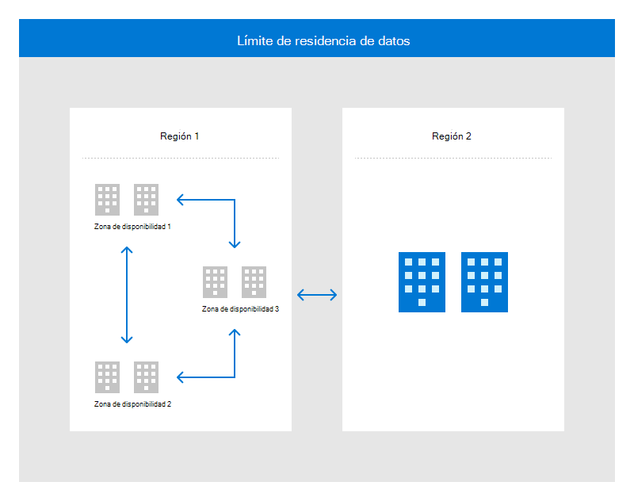

# Arquitectura e infraestructura del centro de datos

Los centros de datos de Microsoft están diseñados para implementar una estrategia de defensa en profundidad, empleando varias capas de protecciones para proteger de forma confiable nuestra arquitectura en la nube y la infraestructura de soporte técnico. La redundancia se basa en todos los sistemas en varios niveles para admitir la disponibilidad del centro de datos.

Microsoft tiene instalaciones de centros de datos de alta seguridad distribuidas en todo el mundo que crean una infraestructura de centros de datos distribuidos, que admite miles de servicios en línea. Esta infraestructura distribuida globalmente está diseñada para acercar las aplicaciones a los usuarios, conservar la residencia de datos y ofrecer a los clientes opciones completas de cumplimiento y resistencia.

Las regiones son conjuntos de centros de datos que están interconectados a través de una red masiva y resistente. Las regiones se organizan en ubicaciones geográficas, lo que otorga a los clientes con necesidades específicas de residencia de datos y cumplimiento la capacidad de mantener sus datos y aplicaciones cerca. La tolerancia a errores integrada permite a las geografías soportar errores de región completos a través de su conexión a la infraestructura de red dedicada y de alta capacidad.

Las ubicaciones físicamente separadas dentro de una región se denominan zonas de disponibilidad, cada una de ellas con uno o varios centros de datos equipados con energía, refrigeración y redes independientes. Las zonas de disponibilidad permiten que las aplicaciones críticas se ejecuten con alta disponibilidad y replicación de baja latencia.

En la siguiente figura se muestra cómo la infraestructura global combina las zonas de disponibilidad y región dentro del mismo límite de residencia de datos para alta disponibilidad, recuperación ante desastres y copia de seguridad.

Los centros de datos distribuidos geográficamente permiten a Microsoft acercar los servicios a los clientes, reducir la latencia de red y permitir la conmutación por error y copia de seguridad con redundancia geográfica.

## Disponibilidad

Los centros de datos de Microsoft están diseñados para proporcionar una disponibilidad del 99,999 % para satisfacer los SLA de clientes y las necesidades de servicio. Microsoft invierte significativamente en las operaciones globales, la administración, las redes y la sostenibilidad de las instalaciones que ofrecen servicios 24x7x365.

## Estándares y requisitos de cumplimiento

Microsoft ha invertido más de 15.000 millones de dólares en la creación de nuestra infraestructura global y más de 9.000 millones de dólares en investigación y desarrollo para aumentar la eficiencia y impulsar la innovación. Como resultado, los centros de datos de Microsoft están evolucionando a un ritmo más rápido que muchas instalaciones del sector y, por lo tanto, no siguen los requisitos prescriptivos que se describen en los estándares tradicionales del centro de datos. Además de la gran cantidad de información operativa que se incluye con la ejecución de una de las carteras de centros de datos más grandes del mundo, Microsoft usa datos ieee Gold Book y software de simulación de confiabilidad de terceros para mejorar continuamente nuestros estándares de diseño de centros de datos. Los centros de datos de Microsoft se auditan extensamente como parte de varias auditorías reglamentarias como se llama en la cartera de cumplimiento. El nivel de madurez en los centros de datos de Microsoft se puede evaluar a través de la cartera de cumplimiento y, específicamente, para la resistencia, la certificación ISO 22301.

Aunque Microsoft opera programas en línea con el espíritu de ansi/TIA-942 Telecommunications Infrastructure of Datacenters Standard, partes de este estándar no son aplicables a Microsoft ni están en conflicto con otros requisitos normativos o específicos del país. Además, Microsoft ha elegido usar un enfoque más basado en el rendimiento para satisfacer las necesidades del cliente.

## Redundancia de red y datos

Las instalaciones críticas del centro de datos emplean varias capas de sistemas redundantes para soportar errores y minimizar las interrupciones del servicio. El almacenamiento con redundancia local en el nivel de disco protege los datos dentro de una región, con almacenamiento con redundancia geográfica que proporciona redundancia dentro de la región. Para garantizar comunicaciones de red confiables, Microsoft posee y utiliza diversas rutas de fibra y hardware redundante para proteger los componentes críticos frente a errores o interrupciones del servicio.

La replicación geográfica se usa para proporcionar redundancia a ubicaciones geográficas alternativas. La durabilidad de los datos se obtiene mediante la replicación sincrónica de datos en varias bases de datos en distintos centros de datos. Las pruebas de restauración se realizan para todos los datos de copia de seguridad que pertenecen a la nube. La recuperación ante desastres se logra mediante la replicación asincrónica en un centro de datos en una región geográfica diferente.

## Capacidad

Cloud Operations es un equipo de capacidad dedicado que prevé los requisitos futuros para garantizar que la capacidad necesaria esté estructurada y disponible para el uso interno y del cliente. Los sistemas se supervisan para garantizar un rendimiento de servicio aceptable, disponibilidad, uso del servicio, uso del almacenamiento, latencia de red y capacidad de registro de auditoría. Microsoft también protege los centros de datos contra los efectos de los ataques por denegación de servicio en el ancho de banda, la capacidad transaccional y la capacidad de almacenamiento.

Todos los equipos de servicio incluyen la planeación de capacidad como una característica clave de sus modelos de centros de datos y planes de replicación de datos para garantizar que hay capacidad necesaria para el procesamiento de información, las telecomunicaciones y el soporte ambiental.

## Alimentación

Los centros de datos de Microsoft han dedicado fuentes de alimentación ininterrumpidas (UPS) 24 x 7 y soporte de energía de emergencia, que incluye generadores locales que proporcionan energía de copia de seguridad. Se realizan regularmente pruebas y mantenimiento de las UPS y los generadores, y los equipos de operaciones tienen acuerdos contractuales con proveedores locales para la entrega de combustible de emergencia. Los centros de datos también tienen un centro de operaciones de instalaciones dedicado para supervisar los sistemas de alimentación, incluidos los componentes críticos de electricidad.

Los centros de datos de Microsoft están equipados con espacios de protección y etiquetado adecuado para los cables. El equipo de infraestructura de energía se coloca en entornos que se han diseñado para protegerse de los riesgos ambientales. Todos los activos de los servicios en línea portátiles deben estar bloqueados o fijados en su lugar para proporcionar protección contra robos o daños en el movimiento. Los cables de alimentación se ejecutan debajo de los suelos, la sobrecarga en las bandejas de cable y dentro de los armarios para protegerse de partes en movimiento y daños accidentales. Todos los espacios eléctricos están detrás de lectores de tarjetas o bloqueos de teclas adicionales según corresponda. Los pasillos de acceso, las entradas exteriores y los patios de equipamiento se supervisan mediante videovigilancia. Los sistemas de energía también usan redundancia como una forma de protección, con varias fuentes de energía/utilidad en la instalación y generadores y sistemas UPS.

Se implementa una fuente de alimentación alternativa a largo plazo para el sistema de información que es capaz de mantener la energía en una capacidad operativa mínimamente necesaria. Cuando la energía falla o cae a un nivel de tensión inaceptable, los sistemas UPS se disponen al instante. Esto proporciona suficiente energía para ejecutar los servidores hasta que los generadores puedan asumir el control. Los generadores de emergencia proporcionan energía de copia de seguridad para interrupciones prolongadas, mantenimiento planeado y pueden operar el centro de datos con reservas de combustible en el sitio si se produce un desastre natural.

Los centros de datos de Microsoft (tanto arrendados como totalmente administrados) implementan iluminación de emergencia en forma de iluminación de emergencia de sobrecarga en circuitos dedicados con copia de seguridad de UPS y sistemas generadores. La iluminación de emergencia automática se implementa de acuerdo con el Código de seguridad de la vida de la Asociación Nacional de Protección contra Incendios y Protección (NFPA) o el código o ley local aplicable. Si se pierde energía de utilidad, la iluminación de emergencia pasará automáticamente a la alimentación proporcionada por el UPS y los sistemas generadores. Los sistemas de iluminación de emergencia de los centros de datos se someten a un mantenimiento rutinario para garantizar que permanecen en buen estado de funcionamiento.

## Mantenimiento

La directiva y los procedimientos de mantenimiento del sistema se han establecido de acuerdo con el estándar de seguridad física y ambiental de Servicios en *línea de Microsoft.* Todos los equipos y sistemas de Microsoft se mantienen periódicamente para garantizar la eficacia operativa. El mantenimiento de cualquier equipo o sistema debe realizarse de acuerdo con las recomendaciones del fabricante, llevado a cabo por personal autorizado y registrado en un vale de mantenimiento.

Hay dos equipos de activos que mantienen diferentes tipos de sistemas:

- **Equipo de entorno crítico (CE):**

    - CE es el equipo que proporciona administración de instalaciones para sistemas eléctricos, mecánicos y físicos que componen la infraestructura operativa de la instalación. El equipo ce programa, realiza, documenta y revisa todas las actividades de mantenimiento realizadas en componentes ce. Los centros de datos de Microsoft dependen de un sistema computarizado para administrar las programaciones de mantenimiento y los pedidos de trabajo.
    - La administración de centros de datos (DCM) es responsable de todo el mantenimiento CE que se realiza en el sitio o de forma remota. El mantenimiento CE se prescribe en documentos paso a paso requeridos denominados Métodos de procedimiento (MOP). La administración del centro de datos revisa o aprueba los MOP antes de iniciar cualquier trabajo.

- **Equipo de Servicios de** sitio:

    - Site Services es el equipo que proporciona el mantenimiento de los activos de servicio en línea de Microsoft ubicados en el centro de datos de Microsoft. El equipo de Servicios de sitio de DC proporciona un servicio de corrección inteligente de manos/interrupción para activos pertenecientes a propiedades que aprovisionan servicios desde el centro de datos. Por ejemplo, los activos que requieren mantenimiento físico podrían solicitar el servicio de manos inteligentes al equipo de Servicios de sitio de DC. Todos los trabajos de Servicios de sitio en activos de Microsoft se programan, realizan, documentan y revisan en vales de trabajo dentro de la herramienta de vales de flujo de trabajo, y no se puede realizar ningún trabajo sin un vale de trabajo aprobado.
    - El equipo del Administrador técnico de programas (TPM) y DCM son responsables de todo el trabajo de Servicios de sitio que se produce en el centro de datos y el trabajo que requiere que el activo se transfiera fuera del sitio. El mantenimiento de Servicios de sitio se realiza en áreas del centro de datos controladas y protegidas por mecanismos de seguridad física.

Si se requiere que los componentes CE se quiten de la instalación, DCM aprueba el tratamiento del equipo. En la mayoría de los casos, los componentes CE reciben mantenimiento in situ y no se quitan de la instalación. Los activos de propiedad (por ejemplo, dispositivos de red o servidores) que requieren transferencia fuera del sitio deben tener aprobación explícita del propietario del activo.

Es posible que los medios digitales dentro de la nube no se transporten desde el espacio de colocación a menos que se mueven para destruirse. Cuando estos activos se van a destruir, se almacenan en contenedores de almacenamiento bloqueados que están bajo cobertura de cámara DE CIRCUITO CERRADO. Cuando los activos estén listos para destruirse, un responsable de seguridad física y un empleado de Tiempo completo de Microsoft de Administración de activos deben escoltar la papelera bloqueada desde el espacio de colocación hasta donde se producirá la destrucción in situ. A medida que se produce la destrucción en el centro de datos y bajo supervisión de Microsoft, los activos de Microsoft no salen de las áreas controladas del centro de datos.

Todo el trabajo de mantenimiento debe aprobarse antes del comienzo del trabajo, incluido el acceso a las herramientas de mantenimiento del sistema. Microsoft Infrastructure ha implementado el control de herramientas de mantenimiento mediante la creación de un nivel de acceso en la Herramienta de acceso a centros de datos (DCAT). Cada instalación contiene una caja de bloqueo física restringida o una sala controlada por acceso para el almacenamiento de herramientas de mantenimiento especializadas. El acceso a la caja de bloqueo o al espacio de almacenamiento se controla en la herramienta DCAT para prohibir el acceso no autorizado a las herramientas de mantenimiento. Este programa garantiza que solo el personal con acceso aprobado pueda acceder a las herramientas. El equipo de Servicios del sitio realiza comprobaciones de inventario rutinarias para comprobar el estado de todas las herramientas. Cada trimestre, el equipo de administración del centro de datos y los equipos de seguridad física realizan auditorías de la lista de acceso de DCAT para mantener actualizada la lista de acceso del personal de mantenimiento. Las terminaciones o transferencias de personal se reflejan inmediatamente a través de una actualización manual de la lista de acceso. El acceso al cuadro de bloqueo o al almacén de mantenimiento se realiza un seguimiento en los registros del lector de distintivos de acceso, que están disponibles para cualquier investigación.

El equipo de Servicios de sitio mantiene un inventario de herramientas de mantenimiento aprobadas para su uso dentro del centro de datos. El personal de mantenimiento debe usar las herramientas de mantenimiento proporcionadas. La aprobación de Administración de centros de datos (DCM) es necesaria para usar herramientas no proporcionadas por el centro de datos. Las herramientas de mano físicas están exentas de este tipo de control.

Los centros de datos de Microsoft mantienen el personal de mantenimiento residente para admitir sistemas críticos de infraestructura de centros de datos (el equipo de Entorno crítico) y operaciones de centros de datos (el equipo de Servicios de sitio). Los equipos de Entorno crítico y Servicios de sitio han identificado componentes críticos del sistema de seguridad y tecnología que mantienen en el sitio. Los servicios críticos del sistema de información se aprovisionan desde más de un centro de datos para evitar una interrupción del servicio debido a un incidente en uno de los centros de datos.
