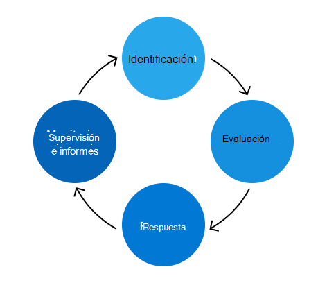

# Microsoft 365 Programa de administración de riesgos

El propósito del programa Microsoft 365 administración de riesgos es identificar, evaluar y administrar los riesgos para Microsoft 365. Microsoft 365 prioridad es cumplir con las obligaciones contractuales y las acreditaciones, aumentar la confianza del cliente y mantener nuestra ventaja competitiva. Aunque el programa Microsoft 365 administración de riesgos de Enterprise funciona de forma independiente, se alinea con las directivas, prioridades y metodologías del programa de administración de riesgos de Enterprise (ERM). Trabajar con el programa ERM permite una comparación coherente entre unidades de negocio y grupos de ingeniería, lo que contribuye a un enfoque más coherente para la administración de riesgos en toda la empresa.

El Microsoft 365 trust es responsable de administrar el programa de administración de riesgos de Microsoft 365 y llevar a cabo las actividades establecidas por el programa ERM. El equipo de confianza se centra en integrar el marco de administración de riesgos con la ingeniería Microsoft 365, las operaciones de servicio y el proceso de cumplimiento existentes para que el programa de administración de riesgos sea más eficaz y eficaz.

El equipo de confianza también mantiene el marco de controles de Microsoft 365, un conjunto de controles racionalizados que, cuando se implementan correctamente con actividades de cumplimiento, permite a los equipos de ingeniería cumplir con las normativas y certificaciones clave. Este marco se actualiza continuamente en función de los comentarios y los resultados como parte del proceso de administración de riesgos.

Las actividades de administración de riesgos se encuadrán en cuatro fases: identificación, evaluación, respuesta y supervisión e informes.

## Identificación

El proceso de administración de riesgos comienza con la identificación de todos los riesgos posibles para todas las áreas de control clave, amenazas internas y externas y vulnerabilidades en el entorno Microsoft 365 principal. La información que guía este proceso proviene de varios orígenes, como entrevistas, exámenes de vulnerabilidades, ejercicios de simulación de ataques, resultados de auditoría y actividades de administración de incidentes.

El equipo de confianza entrevista a expertos en la materia (PYME) de varios equipos de servicio sobre riesgos identificados previamente y posibles riesgos futuros que pueden introducirse a medida que los servicios crecen. Además, las pymes ayudan a validar la precisión y la integridad de los riesgos identificados desde los otros orígenes de supervisión continua.

La fase de identificación también se produce cuando se revisan los registros de decisiones, las excepciones activas de seguridad y cumplimiento y el trabajo de mitigación de evaluaciones de riesgos anteriores.

## Evaluación

Cada riesgo identificado se evalúa con tres métricas: impacto, probabilidad y deficiencia de control.

- El impacto hace referencia al daño que se produciría al servicio, a la empresa o a Microsoft si se realizara ese riesgo. El impacto en Microsoft puede incluir daños a la reputación, pérdida de clientes o implicaciones legales y de cumplimiento.
- La probabilidad define la probabilidad del riesgo potencial que se va a realizar y se calcula analizando la probabilidad y la frecuencia con la que se producirá.
- La deficiencia de control mide la eficacia de los controles de mitigación implementados.

Estas métricas se usan para calcular una puntuación de riesgo que representa la gravedad de cada riesgo, lo que representa las estrategias de mitigación existentes. Los riesgos se agregan y se presentan a las partes interesadas clave de cada servicio para comprobar la precisión y la integridad de Microsoft 365 posición de riesgo de los usuarios.

## Respuesta

Al usar la lista verificada de riesgos para Microsoft 365, el equipo de confianza asigna riesgos al servicio afectado para la respuesta de riesgos. Las directrices definidas ayudan a determinar la estrategia de respuesta de riesgo adecuada en función de la puntuación de riesgo y la eficacia del control. Las estrategias de respuesta a riesgos se encuadrán en cuatro categorías:

- Tolerar: áreas de exposición de bajo riesgo con un bajo nivel de control.
- Operar: áreas de exposición de bajo riesgo en las que los controles se consideran adecuados.
- Monitor: áreas de exposición de alto riesgo en las que los controles se consideran adecuados y deben supervisarse para obtener eficacia.
- Mejorar: áreas de exposición de alto riesgo con un bajo nivel de control que son las prioridades principales en el abordamiento.

El equipo de confianza se coordina con los equipos de servicio para desarrollar planes para abordar cada riesgo. El nivel de gravedad determina el nivel adecuado de revisión y aprobación para cada plan. Para los riesgos que requieren acción, los procesos de error de ingeniería existentes se usan para realizar un seguimiento, administrar y tomar decisiones de excepción. El uso de un proceso familiar para los equipos de ingeniería y operación hace que la respuesta a riesgos sea más eficaz y eficaz.

## Supervisión e informes

Los riesgos identificados como parte de la evaluación de riesgos se supervisan e notifican a las partes interesadas relevantes. Las estrategias de supervisión incluyen supervisión de seguridad, revisiones periódicas de riesgos, pruebas de penetración y análisis de vulnerabilidades. Estos esfuerzos de supervisión actúan como orígenes de datos para informar sobre indicadores clave de rendimiento, crear paneles y desarrollar informes formales, todos los cuales informan sobre decisiones de riesgo futuras.

Varias veces al año, el equipo de confianza se reúne con los propietarios de riesgos de cada servicio para revisar las puntuaciones de riesgo, evaluar la eficacia de sus planes de acción y realizar actualizaciones cuando sea necesario. Además, las actividades de evaluación de riesgos de Microsoft 365 contribuyen a las evaluaciones de riesgos de Enterprise del programa ERM, que proporcionan una visión general de alto nivel de la posición de riesgo de Microsoft para la administración senior de Microsoft y el programa ERM.
