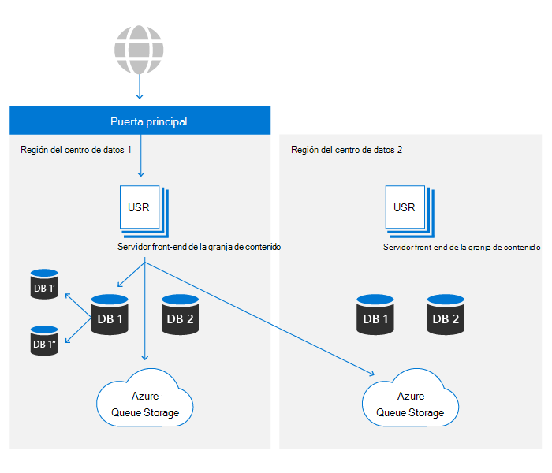
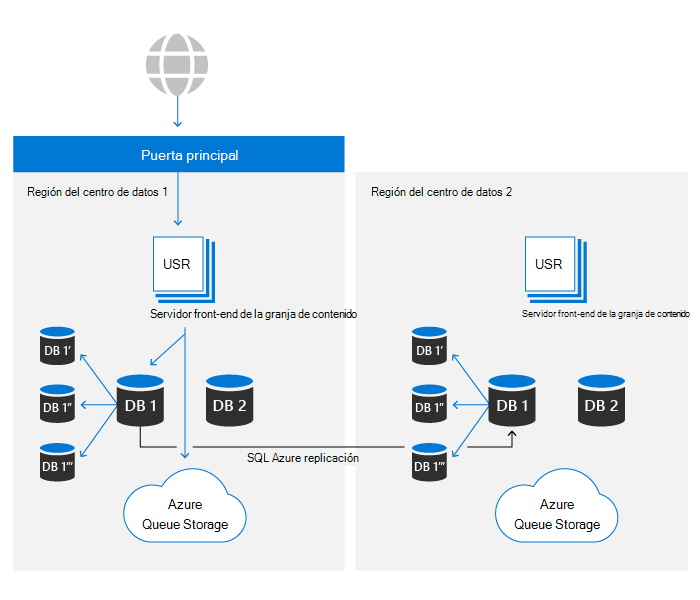

# Resistencia de datos de SharePoint y OneDrive en Microsoft 365

Dentro de Microsoft 365, OneDrive se basa en la plataforma de archivos de SharePoint. En este artículo, solo se usará SharePoint para hacer referencia a ambos productos. El contenido de este artículo es relevante para Microsoft 365 y no se aplica a los servicios de consumidores.

Hay dos activos principales que son el almacenamiento de contenido principal de SharePoint:

- **Metadatos:** los metadatos sobre cada archivo se almacenan en Azure SQL base de datos. Azure SQL ofrece una historia completa de continuidad empresarial que SharePoint usa y los detalles se tratan más adelante en este artículo.
- **Almacenamiento de blobs:** el contenido del usuario que se carga en SharePoint se almacena en Azure Storage. SharePoint ha creado un plan de resistencia personalizado sobre Azure Storage para garantizar la duplicación casi en tiempo real del contenido del usuario y un sistema realmente activo/activo.

El conjunto completo de controles para garantizar la resistencia de los datos se explica en otras secciones.

## Resistencia de almacenamiento de blobs

SharePoint tiene una solución personalizada para el almacenamiento de datos de clientes en Azure Storage. Cada archivo se escribe simultáneamente en una región de centro de datos principal y secundaria. Si se producirá un error en las escrituras en cualquiera de las regiones de Azure, se producirá un error al guardar el archivo. Después de escribir el contenido en Azure Storage, las sumas de comprobación se almacenan por separado con metadatos y se usan para garantizar que la escritura confirmada sea idéntica al archivo original enviado a SharePoint durante todas las lecturas futuras. Esta misma técnica se usa en todos los flujos de trabajo para evitar la propagación de cualquier daño que se produzca. Dentro de cada región, Azure Locally Redundant Storage (LRS) proporciona un alto nivel de confiabilidad. Consulte el [artículo sobre redundancia de Azure Storage](/azure/storage/common/storage-redundancy-lrs) para obtener más información.

SharePoint usa Append-Only almacenamiento. Este proceso garantiza que los archivos no se puedan cambiar ni dañar después de un guardado inicial, pero también mediante el control de versiones en el producto, se puede recuperar cualquier versión anterior del contenido del archivo.

Los entornos de SharePoint en cualquiera de los centros de datos pueden tener acceso a contenedores de almacenamiento en ambas regiones de Azure. Por motivos de rendimiento, siempre se prefiere el contenedor de almacenamiento en el mismo centro de datos local, pero las solicitudes de lectura que no vean resultados dentro del umbral deseado tendrán el mismo contenido solicitado desde el centro de datos remoto para garantizar que los datos estén siempre disponibles.

## Resistencia de metadatos

Los metadatos de SharePoint también son fundamentales para obtener acceso al contenido del usuario, ya que almacena la ubicación y las claves de acceso al contenido almacenado en Azure Storage. Estas bases de datos se almacenan en Azure SQL, que tiene un amplio [plan de continuidad empresarial.](/azure/sql-database/sql-database-business-continuity)

SharePoint usa el modelo de replicación proporcionado por Azure SQL y ha creado una tecnología de automatización propietaria para determinar que se requiere una conmutación por error e iniciar la operación si es necesario. Por lo tanto, entra en la categoría "Conmutación por error manual de base de datos" desde una perspectiva SQL Azure. Las métricas más recientes para la recuperación SQL base de datos de Azure están disponibles [aquí.](/azure/azure-sql/database/business-continuity-high-availability-disaster-recover-hadr-overview#recover-a-database-to-the-existing-server)

SharePoint usa el sistema de copia de seguridad de Azure SQL para habilitar las restauraciones de punto en tiempo (PITR) durante un máximo de 14 días. PITR se trata más en una [sección posterior.](#deletion-backup-and-point-in-time-restore)

## Conmutación por error automatizada

SharePoint usa una conmutación por error automatizada creada a medida para minimizar el impacto en la experiencia del cliente cuando se produce un evento específico de la ubicación. La automatización controlada por la supervisión que detecta un error de uno o varios componentes más allá de ciertos umbrales dará como resultado la redirección automatizada de la actividad de todos los usuarios fuera del entorno problemático y a un secundario caliente. Una conmutación por error da como resultado que los metadatos y el almacenamiento de proceso se sirven completamente fuera del nuevo centro de datos. Como el almacenamiento de blobs siempre se ejecuta completamente activo o activo, no se requiere ningún cambio para una conmutación por error. El nivel de proceso prefiere el contenedor de blobs más cercano, pero usará las ubicaciones de almacenamiento de blobs locales y remotas en cualquier momento para garantizar la disponibilidad.

SharePoint usa el servicio de puerta frontal de Azure para proporcionar enrutamiento interno a la red de Microsoft. Esta configuración permite la redirección de conmutación por error independiente de DNS y reduce el efecto del almacenamiento en caché de la máquina local. La mayoría de las operaciones de conmutación por error son transparentes para los usuarios finales. Si hay una conmutación por error, los clientes no tendrán que realizar cambios para mantener el acceso al servicio.

## Control de versiones y restauración de archivos

Para las bibliotecas de documentos recién creadas, SharePoint tiene un valor predeterminado de 500 versiones en cada archivo y se puede configurar para conservar más versiones si se desea. La interfaz de usuario no permite establecer un valor inferior a 100 versiones, pero es posible establecer el sistema para almacenar menos versiones mediante API públicas. Por motivos de confiabilidad, no se recomienda cualquier valor inferior a 100 y puede provocar una pérdida de datos involuntaria por parte del usuario.

Para obtener más información acerca del control de versiones, vea [Control de versiones en SharePoint](/microsoft-365/community/versioning-basics-best-practices).

La restauración de archivos es la capacidad de ir "atrás en el tiempo" en cualquier biblioteca de documentos de SharePoint a cualquier segundo de tiempo en los últimos 30 días. Este proceso se puede usar para recuperarse de ransomware, eliminaciones masivas, daños o cualquier otro evento. Esta característica usa versiones de archivo, por lo que reducir las versiones predeterminadas puede reducir la eficacia de esta restauración.

La característica Restaurar archivos está documentada para [OneDrive](https://support.office.com/article/restore-your-onedrive-fa231298-759d-41cf-bcd0-25ac53eb8a15) y [SharePoint.](https://support.office.com/article/Restore-a-document-library-317791c3-8bd0-4dfd-8254-3ca90883d39a)

## Eliminación, copia de seguridad y restauración de punto en tiempo

El contenido de usuario eliminado de SharePoint pasa por el siguiente flujo de eliminación.

Los elementos eliminados se conservan en las papeleras de reciclaje durante un período de tiempo determinado. Para SharePoint, el tiempo de retención es de 93 días. Comienza cuando se elimina el elemento de su ubicación original. Cuando se elimina el elemento de la papelera de reciclaje del sitio, se pasa a la papelera de reciclaje [de la colección de sitios](https://support.office.com/article/restore-deleted-items-from-the-site-collection-recycle-bin-5fa924ee-16d7-487b-9a0a-021b9062d14b). Permanece allí durante el resto de los 93 días y, a continuación, se elimina permanentemente. Encontrará más información sobre cómo usar la papelera de reciclaje en estos vínculos:

- [Restaurar elementos en la papelera de reciclaje](https://support.office.com/article/Restore-items-in-the-Recycle-Bin-of-a-SharePoint-site-6df466b6-55f2-4898-8d6e-c0dff851a0be)
- [Restaure los elementos eliminados de la Papelera de reciclaje de la colección de sitios](https://support.office.com/article/Restore-deleted-items-from-the-site-collection-recycle-bin-5fa924ee-16d7-487b-9a0a-021b9062d14b).

Este proceso es el flujo de eliminación predeterminado y no tiene en cuenta las directivas o etiquetas de retención. Para obtener más información, vea [Learn about retention for SharePoint and OneDrive](/microsoft-365/compliance/retention-policies-sharepoint).

Una vez completada la canalización de reciclaje de 93 días, la eliminación se realiza de forma independiente para metadatos y almacenamiento de blobs. Los metadatos se quitarán inmediatamente de la base de datos, lo que hace que el contenido sea ilegible a menos que los metadatos se restablezcan a partir de la copia de seguridad. SharePoint mantiene 14 días de copias de seguridad de metadatos. Estas copias de seguridad se toman localmente en tiempo casi real y, a continuación, se insertan en el almacenamiento en contenedores redundantes de Azure Storage [en,](/azure/sql-database/sql-database-automated-backups) de acuerdo con la documentación en el momento de esta publicación, una programación de 5 a 10 minutos.

Al eliminar el contenido de Blob Storage, SharePoint usa la característica de eliminación suave de Azure Blob Storage para proteger contra eliminaciones accidentales o malintencionadas. Con esta característica, tenemos un total de 14 días para restaurar el contenido antes de que se elimine permanentemente.

>[!Note]
>Aunque las aplicaciones microsoft enviarán contenido a la papelera de reciclaje para el proceso estándar, SharePoint proporciona API que permiten omitir la papelera de reciclaje y forzar una eliminación inmediata. Revise las aplicaciones para asegurarse de que esto solo se realiza cuando sea necesario por motivos de cumplimiento.

## Comprobaciones de integridad

SharePoint usa varios métodos para garantizar la integridad de blobs y metadatos en todas las etapas del ciclo de vida de los datos:

- **Hash de archivo almacenado en metadatos:** el hash de todo el archivo se almacena con metadatos de archivo para garantizar que la integridad de los datos del nivel de documento se mantenga durante todas las operaciones
- **Hash de blob almacenado en** metadatos: cada elemento blob almacena un hash del contenido cifrado para protegerlo contra daños en el almacenamiento de Azure subyacente.
- **Trabajo de integridad** de datos: cada 14 días, cada sitio se examina en busca de integridad enumerando elementos de la base de datos y haciendo coincidir los elementos con blobs enumerados en Azure Storage. El trabajo informa de que faltan blobs en referencias a blobs y puede recuperar esos blobs a través de la característica de eliminación suave de [Azure Storage](/azure/storage/blobs/soft-delete-blob-overview) si es necesario.
