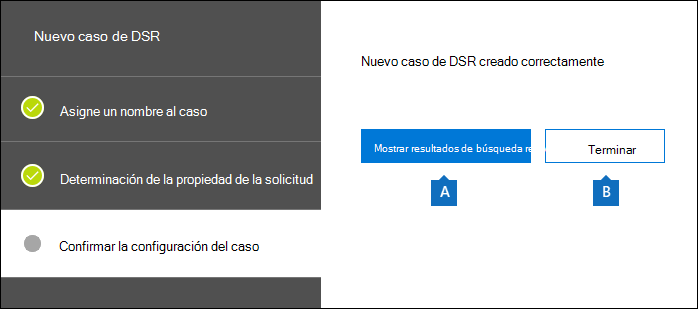
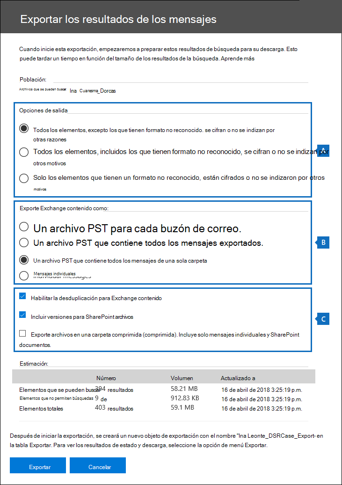
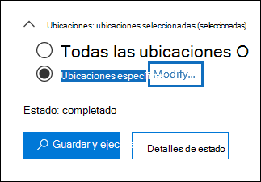
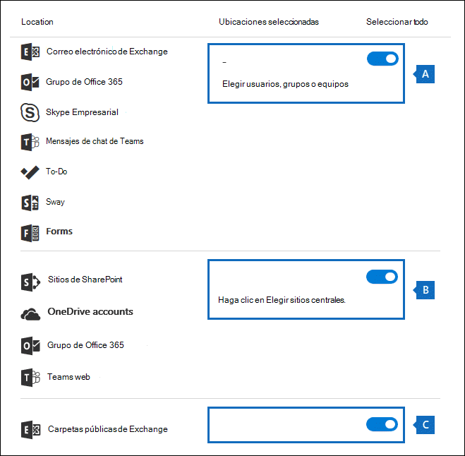

# <a name="manage-gdpr-data-subject-requests-with-the-dsr-case-tool-in-the-security--compliance-center"></a><span data-ttu-id="b5ce5-103">Administrar solicitudes del interesado de GDPR con la herramienta de casos de DSR en el Centro de seguridad y cumplimiento</span><span class="sxs-lookup"><span data-stu-id="b5ce5-103">Manage GDPR data subject requests with the DSR case tool in the Security & Compliance Center</span></span>

<span data-ttu-id="b5ce5-104">El Reglamento general de protección de datos (RGPD) de la UE trata de proteger y facilitar los derechos de privacidad individuales dentro de la Unión Europea (UE).</span><span class="sxs-lookup"><span data-stu-id="b5ce5-104">The EU General Data Protection Regulation (GDPR) is about protecting and enabling individuals' privacy rights inside the European Union (EU).</span></span> <span data-ttu-id="b5ce5-105">El GDPR proporciona a los individuos de la Unión Europea (conocidos como interesados) el derecho a acceder, recuperar, corregir, borrar y restringir el procesamiento de sus datos personales.</span><span class="sxs-lookup"><span data-stu-id="b5ce5-105">The GDPR gives individuals in the European Union (known as data subjects) the right to access, retrieve, correct, erase, and restrict processing of their personal data.</span></span> <span data-ttu-id="b5ce5-106">Según el GDPR, los datos personales hacen referencia a cualquier información relacionada con una persona física identificada o identificable.</span><span class="sxs-lookup"><span data-stu-id="b5ce5-106">Under the GDPR, personal data means any information relating to an identified or identifiable natural person.</span></span> <span data-ttu-id="b5ce5-107">Una solicitud formal de una persona de la organización para que realice una acción sobre sus datos personales se denomina Solicitud del interesado o DSR.</span><span class="sxs-lookup"><span data-stu-id="b5ce5-107">A formal request by a person to their organization to take an action on their personal data is called a Data Subject Request or DSR.</span></span> <span data-ttu-id="b5ce5-108">Para obtener información detallada sobre cómo responder a las DSR de datos en Office 365, vea [Guía de solicitud de inquilino en Office 365](https://go.microsoft.com/fwlink/?linkid=871169 ).</span><span class="sxs-lookup"><span data-stu-id="b5ce5-108">For detailed information about responding to DSRs for data in Office 365, see [Office 365 Data Subject Request Guide](https://go.microsoft.com/fwlink/?linkid=871169 ).</span></span>
  
<span data-ttu-id="b5ce5-109">Para administrar las investigaciones en respuesta a una DSR enviada por una persona de la organización, puede usar la herramienta de casos de DSR del Centro de seguridad y cumplimiento para buscar contenido almacenado en:</span><span class="sxs-lookup"><span data-stu-id="b5ce5-109">To manage investigations in response to a DSR submitted by a person in your organization, you can use the DSR case tool in the Security & Compliance Center to find content stored in:</span></span>
  
- <span data-ttu-id="b5ce5-110">Cualquier buzón de usuario de su organización.</span><span class="sxs-lookup"><span data-stu-id="b5ce5-110">Any user mailbox in your organization.</span></span> <span data-ttu-id="b5ce5-111">Esto incluye las conversaciones de Skype Empresarial y los chats uno a uno en Microsoft Teams</span><span class="sxs-lookup"><span data-stu-id="b5ce5-111">This includes Skype for Business conversations and one-to-one chats in Microsoft Teams</span></span>
    
- <span data-ttu-id="b5ce5-112">Todos los buzones asociados a un grupo de Microsoft 365 y todos los buzones de equipo en Microsoft Teams</span><span class="sxs-lookup"><span data-stu-id="b5ce5-112">All mailboxes associated with an Microsoft 365 Group and all team mailboxes in Microsoft Teams</span></span>
    
- <span data-ttu-id="b5ce5-113">Todos los sitios de SharePoint Online y OneDrive para la Empresa de la organización</span><span class="sxs-lookup"><span data-stu-id="b5ce5-113">All SharePoint Online sites and OneDrive for Business accounts in your organization</span></span>
    
- <span data-ttu-id="b5ce5-114">Todos los sitios de Teams y sitios de grupo de Microsoft 365 de su organización</span><span class="sxs-lookup"><span data-stu-id="b5ce5-114">All Teams sites and Microsoft 365 Group sites in your organization</span></span>
    
- <span data-ttu-id="b5ce5-115">Todas las carpetas públicas de Exchange Online</span><span class="sxs-lookup"><span data-stu-id="b5ce5-115">All public folders in Exchange Online</span></span>
    
<span data-ttu-id="b5ce5-116">Con la herramienta de casos de DSR puede:</span><span class="sxs-lookup"><span data-stu-id="b5ce5-116">Using the DSR case tool you can:</span></span>
  
- <span data-ttu-id="b5ce5-117">Crear un caso independiente para cada investigación de DSR.</span><span class="sxs-lookup"><span data-stu-id="b5ce5-117">Create a separate case for each DSR investigation.</span></span>
    
- <span data-ttu-id="b5ce5-118">Controlar quién tiene acceso al caso de DSR agregando personas como miembros del caso. Solo los miembros pueden acceder al caso y solo pueden ver sus propios casos en la lista de la página **casos de DSR** en el Centro de seguridad y cumplimiento.</span><span class="sxs-lookup"><span data-stu-id="b5ce5-118">Control who has access to the DSR case by adding people as members of the case; only members can access the case and can only see their cases in the list of cases on the **DSR cases** page in the Security & Compliance Center.</span></span> <span data-ttu-id="b5ce5-119">También, puede asignar permisos diferentes a distintos miembros del mismo caso.</span><span class="sxs-lookup"><span data-stu-id="b5ce5-119">Also, you can assign different permissions to different members of the same case.</span></span> <span data-ttu-id="b5ce5-120">Por ejemplo, puede permitir que algunos miembros solo vean el caso y los resultados de búsqueda, mientras que otros son capaces de crear búsquedas y exportar resultados de búsqueda.</span><span class="sxs-lookup"><span data-stu-id="b5ce5-120">For example, you can allow some members to only view the case and search results and allow other members to create searches and export search results.</span></span> 
    
- <span data-ttu-id="b5ce5-121">Usar la búsqueda integrada para buscar todo el contenido relacionado o cargado por un determinado interesado.</span><span class="sxs-lookup"><span data-stu-id="b5ce5-121">Use the built-in search to search for all content created or uploaded by a specific data subject.</span></span>
    
- <span data-ttu-id="b5ce5-122">Opcionalmente, revise la consulta de búsqueda integrada y vuelva a ejecutar la búsqueda para restringir los resultados de búsqueda.</span><span class="sxs-lookup"><span data-stu-id="b5ce5-122">Optionally revise the built-in search query and rerun the search to narrow the search results.</span></span>
    
- <span data-ttu-id="b5ce5-123">Agregar otras búsquedas de contenido asociadas al caso de DSR.</span><span class="sxs-lookup"><span data-stu-id="b5ce5-123">Add other content searches associated with the DSR case.</span></span> <span data-ttu-id="b5ce5-124">Esto incluye la creación de búsquedas que devuelven elementos indizados parcialmente y registros generados por el sistema desde el Servicio de roaming de Office.</span><span class="sxs-lookup"><span data-stu-id="b5ce5-124">This includes creating searches that return partially indexed items and system-generated logs from the Office Roaming Service.</span></span>
    
- <span data-ttu-id="b5ce5-125">Exportar datos como respuesta a una solicitud de exportación o a un acceso de DSR.</span><span class="sxs-lookup"><span data-stu-id="b5ce5-125">Export data in response to a DSR access or export request.</span></span>
    
- <span data-ttu-id="b5ce5-p105">Eliminar los casos cuando se complete el proceso de investigación de DSR. Se quitarán todas las búsquedas de contenido y trabajos de exportación asociados al caso.</span><span class="sxs-lookup"><span data-stu-id="b5ce5-p105">Delete cases when the DSR investigation process is complete. This removes all searches and export jobs associated with the case.</span></span>
    
<span data-ttu-id="b5ce5-128">Este es el proceso de alto nivel para usar la herramienta de casos de DSR para administrar investigaciones de DSR:</span><span class="sxs-lookup"><span data-stu-id="b5ce5-128">Here's the high-level process for using the DSR case tool to manage DSR investigations:</span></span>
  
[<span data-ttu-id="b5ce5-129">Paso 1: Asignar los permisos eDiscovery a miembros de casos potenciales</span><span class="sxs-lookup"><span data-stu-id="b5ce5-129">Step 1: Assign eDiscovery permissions to potential case members</span></span>](#step-1-assign-ediscovery-permissions-to-potential-case-members)

[<span data-ttu-id="b5ce5-130">Paso 2: Crear un caso de DSR y agregar miembros</span><span class="sxs-lookup"><span data-stu-id="b5ce5-130">Step 2: Create a DSR case and add members</span></span>](#step-2-create-a-dsr-case-and-add-members)

[<span data-ttu-id="b5ce5-131">Paso 3: Ejecutar la consulta de búsqueda</span><span class="sxs-lookup"><span data-stu-id="b5ce5-131">Step 3: Run the search query</span></span>](#step-3-run-the-search-query)

[<span data-ttu-id="b5ce5-132">Paso 4: Exportar los datos</span><span class="sxs-lookup"><span data-stu-id="b5ce5-132">Step 4: Export the data</span></span>](#step-4-export-the-data)

[<span data-ttu-id="b5ce5-133">(Opcional) Paso 5: Revisar la consulta de búsqueda integrada</span><span class="sxs-lookup"><span data-stu-id="b5ce5-133">(Optional) Step 5: Revise the built-in search query</span></span>](#optional-step-5-revise-the-built-in-search-query)

[<span data-ttu-id="b5ce5-134">Más información acerca del uso de la herramienta de casos de DSR</span><span class="sxs-lookup"><span data-stu-id="b5ce5-134">More information about using the DSR case tool</span></span>](#more-information-about-using-the-dsr-case-tool)
  
> [!IMPORTANT]
> <span data-ttu-id="b5ce5-135">Nuestras herramientas pueden ayudar a los administradores a realizar solicitudes de exportación o acceso de DSR permitiéndoles usar la búsqueda integrada y la función de exportación que se encuentra en la herramienta de casos de DSR.</span><span class="sxs-lookup"><span data-stu-id="b5ce5-135">Our tools can help admins perform DSR access or export requests by enabling them to utilize the built-in search and export functionality found in the DSR case tool.</span></span> <span data-ttu-id="b5ce5-136">La herramienta ayuda a facilitar un mejor método de esfuerzo para exportar datos relevantes para una solicitud DSR enviada por un interesado.</span><span class="sxs-lookup"><span data-stu-id="b5ce5-136">The tool helps to facilitate a best-effort method to export data that's relevant to a DSR request submitted by a data subject.</span></span> <span data-ttu-id="b5ce5-137">Sin embargo, es importante tener en cuenta que los resultados de búsqueda pueden variar en función del interesado o de las acciones del administrador realizadas que pueden afectar a si un elemento se consideraría o no como "datos personales" con fines de exportación.</span><span class="sxs-lookup"><span data-stu-id="b5ce5-137">However, it's important to note that search results can vary based on the data subject or the admin actions taken that may impact whether or not an item would be deemed as "personal data" for export purposes.</span></span> <span data-ttu-id="b5ce5-138">Por ejemplo, si el interesado era la última persona en modificar un archivo que no creó, es posible que el archivo no se devuelva en los resultados de la búsqueda.</span><span class="sxs-lookup"><span data-stu-id="b5ce5-138">For example, if the data subject was the last person to modify a file they didn't create, the file might not be returned in the search results.</span></span> <span data-ttu-id="b5ce5-139">De forma similar, un administrador podría exportar datos sin incluir elementos parcialmente indizados o todas las versiones de documentos de SharePoint.</span><span class="sxs-lookup"><span data-stu-id="b5ce5-139">Similarly, an admin could export data without including partially indexed items or all versions of SharePoint documents.</span></span> <span data-ttu-id="b5ce5-140">Por lo tanto, las herramientas proporcionadas pueden ayudar a facilitar el acceso y la exportación de solicitudes de datos. No obstante, los resultados están sujetos a escenarios de uso específicos de administradores e interesados.</span><span class="sxs-lookup"><span data-stu-id="b5ce5-140">Therefore, the tools provided can help facilitate accessing and exporting data requests; however, the results are subject to specific admin and data subject usage scenarios.</span></span> 
  
## <a name="step-1-assign-ediscovery-permissions-to-potential-case-members"></a><span data-ttu-id="b5ce5-141">Paso 1: Asignar permisos de exhibición de documentos electrónicos a posibles miembros del caso</span><span class="sxs-lookup"><span data-stu-id="b5ce5-141">Step 1: Assign eDiscovery permissions to potential case members</span></span>

<span data-ttu-id="b5ce5-142">De forma predeterminada, un administrador global puede acceder a la herramienta de casos de DSR en el Centro de seguridad y cumplimiento.</span><span class="sxs-lookup"><span data-stu-id="b5ce5-142">By default, a global administrator can access the DSR case tool in the Security & Compliance Center.</span></span> <span data-ttu-id="b5ce5-143">Por diseño, otros usuarios como un responsable de privacidad de datos, un administrador de recursos humanos u otras personas implicadas en investigaciones de DSR no tienen acceso a la herramienta del caso de DSR y tendrán que asignar los permisos adecuados para acceder a la herramienta.</span><span class="sxs-lookup"><span data-stu-id="b5ce5-143">By design, other users such as a data privacy officer, a human resources manager, or other people involved in DSR investigations don't have access to the DSR case tool and will have to be assigned the appropriate permissions to access the tool.</span></span> <span data-ttu-id="b5ce5-144">La manera más sencilla de hacerlo es ir a la página **Permisos** del Centro de seguridad y cumplimiento y añadir usuarios al grupo de roles de administrador eDiscovery.</span><span class="sxs-lookup"><span data-stu-id="b5ce5-144">The easiest way to do this is to go to the **Permissions** page in the Security & Compliance Center and add users to the eDiscovery Manager role group.</span></span> <span data-ttu-id="b5ce5-145">También tiene que asignar estos permisos para que pueda agregarlos como miembros del caso de DSR que cree en el paso 2.</span><span class="sxs-lookup"><span data-stu-id="b5ce5-145">You also have to assign these permissions so you can add them as members of the DSR case that you create in Step 2.</span></span> 
  
<span data-ttu-id="b5ce5-146">Para las instrucciones paso a paso, vea [Asignar permisos de exhibición de documentos electrónicos en el Centro de seguridad y cumplimiento de Office 365](/microsoft-365/compliance/assign-ediscovery-permissions)</span><span class="sxs-lookup"><span data-stu-id="b5ce5-146">For step-by-step instructions, see [Assign eDiscovery permissions in the Office‍ 365 Security & Compliance Center](/microsoft-365/compliance/assign-ediscovery-permissions).</span></span>
  
> [!NOTE]
> <span data-ttu-id="b5ce5-147">De forma predeterminada, los administradores globales (u otros miembros del grupo de roles de administración de la organización en el Centro de seguridad y cumplimiento) no tienen los permisos necesarios para exportar resultados de búsqueda de contenido (vea el paso 4 de este artículo).</span><span class="sxs-lookup"><span data-stu-id="b5ce5-147">By default, a global administrator (or other members of the Organization Management role group in the Security & Compliance Center don't have the necessary permissions to export Content Search results (see Step 4 in this article).</span></span> <span data-ttu-id="b5ce5-148">Para abordar esto, un administrador puede agregarse a sí mismo como miembro del grupo de roles de administración de eDiscovery.</span><span class="sxs-lookup"><span data-stu-id="b5ce5-148">To address this, an admin can add themselves as a member of the eDiscovery Manager role group.</span></span> 
  
## <a name="step-2-create-a-dsr-case-and-add-members"></a><span data-ttu-id="b5ce5-149">Paso 2: Crear un caso de DSR y agregar miembros</span><span class="sxs-lookup"><span data-stu-id="b5ce5-149">Step 2: Create a DSR case and add members</span></span>

<span data-ttu-id="b5ce5-150">El siguiente paso consiste en crear un caso de DSR.</span><span class="sxs-lookup"><span data-stu-id="b5ce5-150">The next step is to create a DSR case.</span></span> <span data-ttu-id="b5ce5-151">Al crear un caso, puede elegir iniciar la búsqueda integrada o puede crear el caso sin iniciar la búsqueda.</span><span class="sxs-lookup"><span data-stu-id="b5ce5-151">When you create a case, you can choose to start the built-in search or you can create the case without starting the search.</span></span> <span data-ttu-id="b5ce5-152">El procedimiento siguiente le indica cómo crear un caso sin iniciar la búsqueda y, a continuación, le mostrará cómo agregar miembros al caso.</span><span class="sxs-lookup"><span data-stu-id="b5ce5-152">The following procedure instructs you to create the case without starting the search and then show you how to add members to the case.</span></span>
  
1. <span data-ttu-id="b5ce5-153">Vaya a [https://protection.office.com](https://protection.office.com) e inicie sesión con su cuenta profesional o educativa.</span><span class="sxs-lookup"><span data-stu-id="b5ce5-153">Go to [https://protection.office.com](https://protection.office.com) and sign in using your work or school account.</span></span> 
    
2. <span data-ttu-id="b5ce5-154">En el Centro de seguridad y cumplimiento, haga clic en **Privacidad de datos** \> **Solicitudes del interesado** y, después, haga clic en  **Nuevo caso de DSR**.</span><span class="sxs-lookup"><span data-stu-id="b5ce5-154">In the Security & Compliance Center, click **Data privacy** \> **Data subject requests**, and then click  **New DSR case**.</span></span>
    
3. <span data-ttu-id="b5ce5-155">En la página desplegable **Nuevo caso de DSR**, asigne un nombre al caso, escriba una descripción opcional y, después, haga clic en **Siguiente**.</span><span class="sxs-lookup"><span data-stu-id="b5ce5-155">On the **New DSR case** flyout page, give the case a name, type an optional description, and then click **Next**.</span></span> <span data-ttu-id="b5ce5-156">El nombre del caso debe ser exclusivo en la organización.</span><span class="sxs-lookup"><span data-stu-id="b5ce5-156">The name of the case must be unique in your organization.</span></span>
    
    > [!TIP]
    > <span data-ttu-id="b5ce5-157">Considere la posibilidad de agregar el nombre de la persona que envió la solicitud de DSR que está investigando en el nombre y/o descripción del nuevo caso.</span><span class="sxs-lookup"><span data-stu-id="b5ce5-157">Consider adding the name of the person who submitted the DSR request that you're investigating in the name and/or description of the new case.</span></span> <span data-ttu-id="b5ce5-158">Tenga en cuenta que solo los miembros de este caso (y los administradores de eDiscovery) podrán ver el caso en la lista de casos de la página **Solicitudes del interesado**.</span><span class="sxs-lookup"><span data-stu-id="b5ce5-158">Note that only members of this case (and eDiscovery Administrators) will be able to see the case in the list of cases on the **Data subject requests** page.</span></span> 
  
4. <span data-ttu-id="b5ce5-159">En la página **Detalles de la solicitud**, en **Interesado (la persona que presentó esta solicitud)**, seleccione la persona para la que desea buscar y exportar datos y después haga clic en **Siguiente**.</span><span class="sxs-lookup"><span data-stu-id="b5ce5-159">On the **Request details** page, under **Data subject (the person who filed this request)**, select the person that you want to find and export data for and then click **Next**.</span></span>
    
5. <span data-ttu-id="b5ce5-160">En la página **Confirmar la configuración del caso**, puede cambiar el nombre y la descripción del caso y seleccionar un interesado diferente.</span><span class="sxs-lookup"><span data-stu-id="b5ce5-160">On the **Confirm your case settings** page, you can change the case name and description, and select a different data subject.</span></span> <span data-ttu-id="b5ce5-161">En caso contrario, haga clic en **Guardar**.</span><span class="sxs-lookup"><span data-stu-id="b5ce5-161">Otherwise, click **Save**.</span></span>
    
    <span data-ttu-id="b5ce5-162">Se muestra una página que confirma que se ha creado el nuevo caso de DSR.</span><span class="sxs-lookup"><span data-stu-id="b5ce5-162">A page is displayed that confirms the new DSR case has been created.</span></span>
    
    
  
    <span data-ttu-id="b5ce5-164">En este punto, puede llevar a cabo una de estas dos cosas:</span><span class="sxs-lookup"><span data-stu-id="b5ce5-164">At this point, you can do one of two things:</span></span>
    
    <span data-ttu-id="b5ce5-165">a.</span><span class="sxs-lookup"><span data-stu-id="b5ce5-165">a.</span></span> <span data-ttu-id="b5ce5-166">Al hacer clic en **Mostrar resultados de búsqueda** se inicia la búsqueda.</span><span class="sxs-lookup"><span data-stu-id="b5ce5-166">Clicking **Show me search results** starts the search.</span></span> <span data-ttu-id="b5ce5-167">Esa es la selección predeterminada.</span><span class="sxs-lookup"><span data-stu-id="b5ce5-167">This is the default selection.</span></span> <span data-ttu-id="b5ce5-168">La búsqueda integrada que se ejecuta al seleccionar esta opción y los resultados devueltos se analizan en el paso 3.</span><span class="sxs-lookup"><span data-stu-id="b5ce5-168">The built-in search that's run when you select this option and the results that are returned are discussed in Step 3.</span></span>
    
    <span data-ttu-id="b5ce5-169">b.</span><span class="sxs-lookup"><span data-stu-id="b5ce5-169">b.</span></span> <span data-ttu-id="b5ce5-170">Al hacer clic en **Finalizar** se cierra el nuevo caso de DSR sin iniciar la búsqueda integrada.</span><span class="sxs-lookup"><span data-stu-id="b5ce5-170">Clicking **Finish** closes the new DSR case without starting the built-in search.</span></span> <span data-ttu-id="b5ce5-171">Al seleccionar esta opción, se muestra el nuevo caso de DSR en la página **Solicitudes del interesado**.</span><span class="sxs-lookup"><span data-stu-id="b5ce5-171">When you select this option, the new DSR case is displayed on the **Data subject requests** page.</span></span>
    
6. <span data-ttu-id="b5ce5-172">Haga clic en **Finalizar** para poder acceder al nuevo caso de DSR y agregarle miembros.</span><span class="sxs-lookup"><span data-stu-id="b5ce5-172">Click **Finish** so that you can go in to the new DSR case and add members to it.</span></span> 
    
7. <span data-ttu-id="b5ce5-173">En la página **Solicitudes del interesado**, haga clic en el nombre del caso de DSR que creó.</span><span class="sxs-lookup"><span data-stu-id="b5ce5-173">On the **Data subject requests** page, click the name of the DSR case that you created.</span></span> 
    
8. <span data-ttu-id="b5ce5-174">En la página desplegable **Controlar este caso**, en **Administrar miembros**, haga clic en **Agregar**.</span><span class="sxs-lookup"><span data-stu-id="b5ce5-174">On the **Manage this case** flyout page, under **Manage members**, click **Add**.</span></span> 
    
    <span data-ttu-id="b5ce5-175">En **Usuarios**, se muestra una lista de personas a las que se les han asignado los permisos de eDiscovery adecuados.</span><span class="sxs-lookup"><span data-stu-id="b5ce5-175">Under **Users**, a list of people that are assigned the appropriate eDiscovery permissions is displayed.</span></span> <span data-ttu-id="b5ce5-176">Las personas a las que asignó los permisos de eDiscovery en el paso 1 se mostrarán en esta lista.</span><span class="sxs-lookup"><span data-stu-id="b5ce5-176">The people you assigned eDiscovery permissions to in Step 1 will be displayed in this list.</span></span> 
    
9. <span data-ttu-id="b5ce5-177">Seleccione a las personas que desea agregar como miembros del caso de DSR, haga clic en **Agregar** y, después, guarde los cambios.</span><span class="sxs-lookup"><span data-stu-id="b5ce5-177">Select the people to add as members of the DSR case, click **Add**, and then save your changes.</span></span>
    
    <span data-ttu-id="b5ce5-178">También puede agregar un grupo de roles como miembros del caso de DSR haciendo clic en **Agregar** en **Administrar grupos de roles**.</span><span class="sxs-lookup"><span data-stu-id="b5ce5-178">You can also add role groups as members of DSR case by clicking **Add** under **Manage role groups**.</span></span> 
    
## <a name="step-3-run-the-search-query"></a><span data-ttu-id="b5ce5-179">Paso 3: Ejecutar la consulta de búsqueda</span><span class="sxs-lookup"><span data-stu-id="b5ce5-179">Step 3: Run the search query</span></span>

<span data-ttu-id="b5ce5-p116">Una vez creado un caso DSR y agregados los miembros, el siguiente paso es ejecutar la búsqueda incorporada que está asociada al caso. Esta consulta de búsqueda predeterminada permite hacer lo siguiente:</span><span class="sxs-lookup"><span data-stu-id="b5ce5-p116">After you create a DSR case and add members, the next step is to run the built-in search that's associated with the case. This default search query does the following things:</span></span>
  
- <span data-ttu-id="b5ce5-182">Busca en todos los buzones de su organización todos los elementos de correo electrónico que el interesado ha enviado o recibido.</span><span class="sxs-lookup"><span data-stu-id="b5ce5-182">Searches all mailboxes in your organization for all email items that were sent or received by the data subject.</span></span> <span data-ttu-id="b5ce5-183">Esto se consigue con la propiedad de correo  *Participantes*, que busca al interesado en todos los campos personas de un mensaje de correo.</span><span class="sxs-lookup"><span data-stu-id="b5ce5-183">This is accomplished by using the  *Participants*  email property, which searches for the data subject in all the people fields in an email message.</span></span> <span data-ttu-id="b5ce5-184">Esta propiedad devuelve los elementos en los que el interesado está en los campos **De**, **Para**, **CC** y **CCO**.</span><span class="sxs-lookup"><span data-stu-id="b5ce5-184">This property returns items in which the data subject is in the **From**, **To**, **CC**, and **BCC** fields.</span></span> <span data-ttu-id="b5ce5-185">En las carpetas públicas en Exchange Online también se buscan los mensajes enviados o recibidos por el interesado.</span><span class="sxs-lookup"><span data-stu-id="b5ce5-185">Public folders in Exchange Online are also searched for messages sent or received by the data subject.</span></span> 
    
- <span data-ttu-id="b5ce5-186">Busca documentos y elementos creados o cargados por el interesado en todos los sitios de su organización.</span><span class="sxs-lookup"><span data-stu-id="b5ce5-186">Searches all sites in your organization for documents and items created or uploaded by the data subject.</span></span> <span data-ttu-id="b5ce5-187">Esto se consigue por medio de las siguientes propiedades del sitio:</span><span class="sxs-lookup"><span data-stu-id="b5ce5-187">This is accomplished by using the following site properties:</span></span>
    
  - <span data-ttu-id="b5ce5-188">La propiedad  *Author*  devuelve los elementos en los que el interesado aparece en el campo de autor de los documentos de Office.</span><span class="sxs-lookup"><span data-stu-id="b5ce5-188">The  *Author*  property returns items where the data subject is listed in the author field in Office documents.</span></span> <span data-ttu-id="b5ce5-189">Este valor persiste, incluso si otra persona copia y carga el documento.</span><span class="sxs-lookup"><span data-stu-id="b5ce5-189">This value persists, even if the document is copied and uploaded by someone else.</span></span> 
    
  - <span data-ttu-id="b5ce5-190">La propiedad  *CreatedBy*  devuelve los elementos creados o cargados por el interesado.</span><span class="sxs-lookup"><span data-stu-id="b5ce5-190">The  *CreatedBy*  property returns items that were created or uploaded by the data subject.</span></span> 
    
<span data-ttu-id="b5ce5-191">Este es el aspecto de la consulta de palabras clave para la búsqueda integrada que se crea automáticamente al crear un caso de DSR.</span><span class="sxs-lookup"><span data-stu-id="b5ce5-191">Here's what the keyword query looks like for the built-in search that gets automatically created when you create a DSR case.</span></span>
  
```powershell
participants:"<email address>" OR author:"<display name>" OR createdby:"<display name>"
```

<span data-ttu-id="b5ce5-192">Por ejemplo, si el nombre del interesado es Ina Leonte, la consulta de palabras clave tendría el siguiente aspecto:</span><span class="sxs-lookup"><span data-stu-id="b5ce5-192">For example, if the name of the data subject is Ina Leonte, the keyword query would look like this:</span></span>
  
```powershell
participants:"ina@contoso.com" OR author:"Ina Leonte" OR createdby:"Ina Leonte"
```

 <span data-ttu-id="b5ce5-193">**Para ejecutar la búsqueda integrada de un caso de DSR:**</span><span class="sxs-lookup"><span data-stu-id="b5ce5-193">**To run the built-in search for a DSR case:**</span></span>
  
1. <span data-ttu-id="b5ce5-194">En el Centro de seguridad y cumplimiento, haga clic en **Privacidad de datos** \> **Solicitudes del interesado** y, después, haga clic en **Abrir** al lado del caso de DSR que ha creado en el paso 2.</span><span class="sxs-lookup"><span data-stu-id="b5ce5-194">In the Security & Compliance Center, click **Data privacy** \> **Data subject requests**, and then click **Open** next to the DSR case that you created in Step 2.</span></span> 
    
    <span data-ttu-id="b5ce5-195">Haga clic en la pestaña **Buscar** en la parte superior de la página y, después, haga clic en la casilla situada junto a la búsqueda integrada que se creó cuando se creó el caso de DSR.</span><span class="sxs-lookup"><span data-stu-id="b5ce5-195">Click the **Search** tab at the top of the page, and then click the checkbox next to the built-in search that was created when you created the DSR case.</span></span> <span data-ttu-id="b5ce5-196">La búsqueda tiene el mismo nombre que el caso de DSR.</span><span class="sxs-lookup"><span data-stu-id="b5ce5-196">The search has the same name as the DSR case.</span></span> 
    
2. <span data-ttu-id="b5ce5-197">En la página de búsqueda flotante, haga clic en **Abrir consulta**.</span><span class="sxs-lookup"><span data-stu-id="b5ce5-197">In the search flyout page, click **Open query**.</span></span>
    
    <span data-ttu-id="b5ce5-198">Al abrir la consulta, la búsqueda se inicia y se completará en unos segundos.</span><span class="sxs-lookup"><span data-stu-id="b5ce5-198">When you open the query, the search is started and will complete in a few moments.</span></span> 
    
3. <span data-ttu-id="b5ce5-199">Una vez completada la búsqueda, haga clic en **Vista previa de los resultados** para obtener una vista previa de los resultados de la búsqueda.</span><span class="sxs-lookup"><span data-stu-id="b5ce5-199">When the search is complete, click **Preview results** to preview the search results.</span></span> <span data-ttu-id="b5ce5-200">Para más información, vea [Vista previa de los resultados de la búsqueda](/microsoft-365/compliance/content-search#preview-search-results).</span><span class="sxs-lookup"><span data-stu-id="b5ce5-200">For more information, see [Preview search results](/microsoft-365/compliance/content-search#preview-search-results).</span></span>
    
    > [!TIP]
    > <span data-ttu-id="b5ce5-201">También puede ver las estadísticas de la consulta de búsqueda para ver el número de elementos de buzón y de sitio devueltos por la búsqueda, y las ubicaciones de contenido principales que contienen elementos que coinciden con la consulta de la búsqueda.</span><span class="sxs-lookup"><span data-stu-id="b5ce5-201">You can also view the search query statistics to see the number of mailbox and site items that are returned by the search, and the top content locations that contain items that match the search query.</span></span> <span data-ttu-id="b5ce5-202">Para mas información, vea [Ver información y estadísticas sobre una búsqueda](/microsoft-365/compliance/content-search#view-information-and-statistics-about-a-search).</span><span class="sxs-lookup"><span data-stu-id="b5ce5-202">For more information, see [View information and statistics about a search](/microsoft-365/compliance/content-search#view-information-and-statistics-about-a-search).</span></span> 
  
<span data-ttu-id="b5ce5-203">Puede editar la consulta de búsqueda integrada, cambiar las ubicaciones de contenido en las que se buscan y, después, volver a ejecutar la búsqueda.</span><span class="sxs-lookup"><span data-stu-id="b5ce5-203">You can edit the built-in search query, change the content locations that are searched, and then rerun the search.</span></span> <span data-ttu-id="b5ce5-204">Vea el [Paso 5](#optional-step-5-revise-the-built-in-search-query) para obtener más información.</span><span class="sxs-lookup"><span data-stu-id="b5ce5-204">See [Step 5](#optional-step-5-revise-the-built-in-search-query) for more information.</span></span> 
  
## <a name="step-4-export-the-data"></a><span data-ttu-id="b5ce5-205">Paso 4: Exportar los datos</span><span class="sxs-lookup"><span data-stu-id="b5ce5-205">Step 4: Export the data</span></span>

<span data-ttu-id="b5ce5-206">Después de ejecutar una búsqueda integrada, puede exportar los resultados de la búsqueda.</span><span class="sxs-lookup"><span data-stu-id="b5ce5-206">After you run the built-in search, you can export the search results.</span></span> <span data-ttu-id="b5ce5-207">Como alternativa, antes de exportar los datos, puede que quiera revisar la consulta para reducir el número de resultados de la búsqueda.</span><span class="sxs-lookup"><span data-stu-id="b5ce5-207">Alternatively, before you export the data, you may want to revise the query to reduce the number of search results.</span></span> <span data-ttu-id="b5ce5-208">Vea el Paso 5 para obtener más información sobre cómo acotar los resultados de la búsqueda.</span><span class="sxs-lookup"><span data-stu-id="b5ce5-208">See Step 5 for more information about narrowing the search results.</span></span>
  
<span data-ttu-id="b5ce5-209">Al exportar los resultados de la búsqueda, los elementos de buzón se pueden descargar en archivos PST o como mensajes individuales.</span><span class="sxs-lookup"><span data-stu-id="b5ce5-209">When you export search results, mailbox items can be downloaded in PST files or as individual messages.</span></span> <span data-ttu-id="b5ce5-210">Al exportar contenido de las cuentas de SharePoint y OneDrive, se exportan copias de documentos nativos de Office y otros documentos.</span><span class="sxs-lookup"><span data-stu-id="b5ce5-210">When you export content from SharePoint and OneDrive accounts, copies of native Office documents and other documents are exported.</span></span> <span data-ttu-id="b5ce5-211">En los resultados de la búsqueda se incluye un archivo de resultados que contiene información sobre todos los elementos exportados.</span><span class="sxs-lookup"><span data-stu-id="b5ce5-211">A results file that contains information about every exported item is included with the search results.</span></span> <span data-ttu-id="b5ce5-212">Para obtener más información detallada sobre la exportación, vea [Exportar resultados de la búsqueda de contenido](/microsoft-365/compliance/export-search-results).</span><span class="sxs-lookup"><span data-stu-id="b5ce5-212">For more detailed information about exporting, see [Export Content Search results](/microsoft-365/compliance/export-search-results).</span></span>
  
> [!NOTE]
> <span data-ttu-id="b5ce5-213">De forma predeterminada, los administradores globales (u otros miembros del grupo de roles de administración de la organización en el Centro de seguridad y cumplimiento) no tienen los permisos necesarios para exportar resultados de búsqueda de contenido.</span><span class="sxs-lookup"><span data-stu-id="b5ce5-213">By default, a global administrator (or other members of the Organization Management role group in the Security & Compliance Center) don't have the necessary permissions to export Content Search results.</span></span> <span data-ttu-id="b5ce5-214">Para abordar esto, un administrador puede agregarse a sí mismo como miembro del grupo de roles de administración de eDiscovery.</span><span class="sxs-lookup"><span data-stu-id="b5ce5-214">To address this, an admin can add themselves as a member of the eDiscovery Manager role group.</span></span> 
  
<span data-ttu-id="b5ce5-215">El equipo que usa para exportar datos debe cumplir los siguientes requisitos del sistema:</span><span class="sxs-lookup"><span data-stu-id="b5ce5-215">The computer you use to export data has to meet the following system requirements:</span></span>
  
- <span data-ttu-id="b5ce5-216">Versiones de 32 o 64 bits de Windows 7 y versiones posteriores</span><span class="sxs-lookup"><span data-stu-id="b5ce5-216">32-bit or 64-bit versions of Windows 7 and later versions</span></span>
    
- <span data-ttu-id="b5ce5-217">Microsoft .NET Framework 4.7</span><span class="sxs-lookup"><span data-stu-id="b5ce5-217">Microsoft .NET Framework 4.7</span></span>
    
- <span data-ttu-id="b5ce5-218">Un explorador compatible:</span><span class="sxs-lookup"><span data-stu-id="b5ce5-218">A supported browser:</span></span>
    
  - <span data-ttu-id="b5ce5-219">Microsoft Edge</span><span class="sxs-lookup"><span data-stu-id="b5ce5-219">Microsoft Edge</span></span>
    
    <span data-ttu-id="b5ce5-220">O bien</span><span class="sxs-lookup"><span data-stu-id="b5ce5-220">Or</span></span>
    
  - <span data-ttu-id="b5ce5-221">Microsoft Internet Explorer 10 y versiones posteriores</span><span class="sxs-lookup"><span data-stu-id="b5ce5-221">Microsoft Internet Explorer 10 and later versions</span></span>
    
    > [!NOTE]
    > <span data-ttu-id="b5ce5-222">Microsoft no produce extensiones de terceros ni complementos para aplicaciones ClickOnce.</span><span class="sxs-lookup"><span data-stu-id="b5ce5-222">Microsoft doesn't manufacture third-party extensions or add-ons for ClickOnce applications.</span></span> <span data-ttu-id="b5ce5-223">No se admite la exportación de datos con un explorador no compatible con extensiones o complementos de terceros.</span><span class="sxs-lookup"><span data-stu-id="b5ce5-223">Exporting data using an unsupported browser with third-party extensions or add-ons isn't supported.</span></span> 
  
 <span data-ttu-id="b5ce5-224">**Para exportar datos de la búsqueda integrada en un caso de DSR:**</span><span class="sxs-lookup"><span data-stu-id="b5ce5-224">**To export data from the built-in search in a DSR case:**</span></span>
  
1. <span data-ttu-id="b5ce5-225">En el Centro de seguridad y cumplimiento, haga clic en **Privacidad de datos** \> **Solicitudes del interesado** y, después, haga clic en **Abrir** al lado del caso de DSR de donde quiere exportar datos.</span><span class="sxs-lookup"><span data-stu-id="b5ce5-225">In the Security & Compliance Center, click **Data privacy** \> **Data subject requests**, and then click **Open** next to the DSR case that you want to export data from.</span></span> 
    
2. <span data-ttu-id="b5ce5-226">Haga clic en la pestaña **Buscar** en la parte superior de la página y, después, haga clic en la casilla situada junto a la búsqueda integrada que se creó cuando se creó el caso de DSR.</span><span class="sxs-lookup"><span data-stu-id="b5ce5-226">Click the **Search** tab at the top of the page, and then click the checkbox next to the built-in search that was created when you created the DSR case.</span></span> <span data-ttu-id="b5ce5-227">O bien, haga clic en otra búsqueda para exportar los datos de esa búsqueda.</span><span class="sxs-lookup"><span data-stu-id="b5ce5-227">Or click another search to export data from that search.</span></span> 
    
3. <span data-ttu-id="b5ce5-228">En la página de búsqueda flotante, haga clic en el  **Más** y después, seleccione **Exportar resultados** de la lista desplegable.</span><span class="sxs-lookup"><span data-stu-id="b5ce5-228">On the search flyout page, click  **More**, and then select **Export results** from the drop-down list.</span></span> 
    
4. <span data-ttu-id="b5ce5-229">En la página **Opciones de exportación**, seleccione las siguientes opciones recomendadas para solicitudes de exportación de DSR.</span><span class="sxs-lookup"><span data-stu-id="b5ce5-229">On the **Export results** page, select the following recommended options for DSR export requests.</span></span> 
    
    
  
    <span data-ttu-id="b5ce5-231">a.</span><span class="sxs-lookup"><span data-stu-id="b5ce5-231">a.</span></span> <span data-ttu-id="b5ce5-232">En **Opciones de salida**, seleccione la primera opción (**Todos los elementos, excluidos los que tienen un formato no reconocido, están cifrados o no se han indexado por otras razones**) para exportar solo elementos indizados.</span><span class="sxs-lookup"><span data-stu-id="b5ce5-232">Under **Output options**, select the first option (**All items, excluding ones that have ones that have an unrecognized format, are encrypted, or weren't indexed for other reasons**) to export indexed items only.</span></span> <span data-ttu-id="b5ce5-233">El motivo por el que no quiere exportar elementos indizados parcialmente desde la búsqueda integrada es que también se exportarán elementos indizados parcialmente de otros usuarios.</span><span class="sxs-lookup"><span data-stu-id="b5ce5-233">The reason you don't want to export partially indexed items from the built-in search is because partially indexed items from other users will also be exported.</span></span> <span data-ttu-id="b5ce5-234">Para exportar solo los elementos indizados parcialmente para el interesado, le recomendamos que cree una búsqueda independiente.</span><span class="sxs-lookup"><span data-stu-id="b5ce5-234">To export only the partially indexed items for the data subject, we recommend that you create a separate search.</span></span> <span data-ttu-id="b5ce5-235">Para más información, vea [Exportar elementos indizados parcialmente](#exporting-partially-indexed-items) en la sección "Más información sobre el uso de la herramienta de casos de DSR".</span><span class="sxs-lookup"><span data-stu-id="b5ce5-235">For more information, see [Exporting partially indexed items](#exporting-partially-indexed-items) in the "More information about using the DSR case tool" section.</span></span>
    
    <span data-ttu-id="b5ce5-236">b.</span><span class="sxs-lookup"><span data-stu-id="b5ce5-236">b.</span></span> <span data-ttu-id="b5ce5-237">En **Exportar contenido de Exchange como**, seleccione la tercera opción: **Un archivo PST que contenga todos los mensajes en una sola carpeta**.</span><span class="sxs-lookup"><span data-stu-id="b5ce5-237">Under **Export Exchange content as**, select the third option, **One PST file containing all messages in a single folder**.</span></span> <span data-ttu-id="b5ce5-238">Dado que algunos de los resultados pueden ser de elementos originados en el buzón de otro usuario, esta opción simplemente enumera el elemento en una sola carpeta sin indicar el buzón actual y es la mejor opción para usar al desduplicar los resultados, tal y como se recomienda en el elemento siguiente.</span><span class="sxs-lookup"><span data-stu-id="b5ce5-238">Because some of the results may be for items that originated in another user's mailbox, this option just lists the item in a single folder without indicating the actual mailbox and is the best option to use when you de-duplicate the results as recommended in the next item.</span></span> <span data-ttu-id="b5ce5-239">Esta opción también permite al interesado revisar los elementos en orden cronológico (los elementos se ordenan por fecha de envío) sin tener que navegar por la estructura de carpetas del buzón original para cada elemento.</span><span class="sxs-lookup"><span data-stu-id="b5ce5-239">This option also lets the data subject review items in chronological order (items are sorted by sent date) without having to navigate the original mailbox folder structure for each item.</span></span>
    
    <span data-ttu-id="b5ce5-240">c.</span><span class="sxs-lookup"><span data-stu-id="b5ce5-240">c.</span></span> <span data-ttu-id="b5ce5-241">Seleccione la opción **Habilitar la desduplicación** para excluir mensajes de correo electrónico duplicados.</span><span class="sxs-lookup"><span data-stu-id="b5ce5-241">Select **Enable de-duplication** option to excludes duplicate email messages.</span></span> <span data-ttu-id="b5ce5-242">Se recomienda esta opción, ya que la búsqueda integrada busca en todos los buzones de la organización.</span><span class="sxs-lookup"><span data-stu-id="b5ce5-242">We recommend this option because the built-in search searches all mailboxes in your organization.</span></span> <span data-ttu-id="b5ce5-243">Por lo tanto, si se encuentran varias copias del mismo mensaje en los buzones en los que se buscaron, esta opción significa que solo se exportará una copia de un mensaje.</span><span class="sxs-lookup"><span data-stu-id="b5ce5-243">So if multiple copies of the same message are found in the mailboxes that were searched, this option means that only one copy of a message will be exported.</span></span> <span data-ttu-id="b5ce5-244">Esta opción, al exportar conjuntamente los mensajes en un archivo PST en una sola carpeta, da como resultado la mejor experiencia de usuario para las solicitudes de exportación de DSR.</span><span class="sxs-lookup"><span data-stu-id="b5ce5-244">This option, together will exporting messages in one PST file in a single folder, results in the best user experience for DSR export requests.</span></span> <span data-ttu-id="b5ce5-245">El informe de exportación Results.csv enumera todas las ubicaciones en las que se encontraron mensajes duplicados.</span><span class="sxs-lookup"><span data-stu-id="b5ce5-245">The Results.csv export report lists all locations where duplicate messages were found.</span></span>
    
    <span data-ttu-id="b5ce5-246">Opcionalmente, puede seleccionar la opción **Incluir versiones para los documentos de SharePoint** y exportar todas las versiones de documentos de SharePoint y OneDrive.</span><span class="sxs-lookup"><span data-stu-id="b5ce5-246">Optionally, you can select **Include versions for SharePoint documents** option to export all versions of SharePoint and OneDrive documents.</span></span> <span data-ttu-id="b5ce5-247">Es necesario que el control de versiones esté activado para las bibliotecas de documentos.</span><span class="sxs-lookup"><span data-stu-id="b5ce5-247">This requires that versioning is turned on for document libraries.</span></span> <span data-ttu-id="b5ce5-248">Esta opción ayuda a garantizar que se exportan todos los datos relevantes.</span><span class="sxs-lookup"><span data-stu-id="b5ce5-248">This option helps to ensure that all relevant data is exported.</span></span>
    
5. <span data-ttu-id="b5ce5-249">Después de elegir la configuración de exportación, haga clic en **Exportar**.</span><span class="sxs-lookup"><span data-stu-id="b5ce5-249">After you choose the export settings, click **Export**.</span></span>
    
    <span data-ttu-id="b5ce5-250">Los resultados de búsqueda se preparan para su descarga, lo que significa que se han cargado en el área de almacenamiento de Azure para la organización en la nube de Microsoft.</span><span class="sxs-lookup"><span data-stu-id="b5ce5-250">The search results are prepared for downloading, which means they're uploaded to the Azure Storage area for your organization in the Microsoft cloud.</span></span> <span data-ttu-id="b5ce5-251">Los pasos siguientes muestran cómo descargar estos datos en el equipo local.</span><span class="sxs-lookup"><span data-stu-id="b5ce5-251">The next steps show you how to download this data to your local computer.</span></span>
    
6. <span data-ttu-id="b5ce5-252">Haga clic en la pestaña **Exportar** para mostrar el trabajo de exportación que creó.</span><span class="sxs-lookup"><span data-stu-id="b5ce5-252">Click the **Export** tab to display the export job you created.</span></span> <span data-ttu-id="b5ce5-253">Los trabajos de exportación tienen el mismo nombre que la búsqueda correspondiente con **_Export** anexado al final del nombre de la búsqueda.</span><span class="sxs-lookup"><span data-stu-id="b5ce5-253">Export jobs have the same name as the corresponding search with **_Export** appended to the end of search name.</span></span> 
    
7. <span data-ttu-id="b5ce5-254">Haga clic en el trabajo de exportación que acaba de crear para mostrar la página desplegable de exportación.</span><span class="sxs-lookup"><span data-stu-id="b5ce5-254">Click the export job that you just created to display the export flyout page.</span></span> <span data-ttu-id="b5ce5-255">En esta página se muestra información sobre la búsqueda, como el tamaño y el número total de elementos que se exportarán y el porcentaje de los elementos que se han transferido a un área de almacenamiento de Azure.</span><span class="sxs-lookup"><span data-stu-id="b5ce5-255">This page shows information about the search, such as the size and total number of items to be exported, and the percentage of the items that have been transferred to an Azure storage area.</span></span> <span data-ttu-id="b5ce5-256">Haga clic en **Actualizar** para actualizar la información de estado de carga.</span><span class="sxs-lookup"><span data-stu-id="b5ce5-256">Click **Refresh** to update the upload status information.</span></span> 
    
8. <span data-ttu-id="b5ce5-257">En **Clave de exportación**, haga clic en **Copiar al Portapapeles**.</span><span class="sxs-lookup"><span data-stu-id="b5ce5-257">Under **Export key**, click **Copy to clipboard**.</span></span> <span data-ttu-id="b5ce5-258">Esta clave se usa para descargar los resultados de la búsqueda en el paso 11.</span><span class="sxs-lookup"><span data-stu-id="b5ce5-258">You use this key in step 11 to download the search results.</span></span>
    
9. <span data-ttu-id="b5ce5-259">Haga clic en el  **Descargar resultados** en la parte superior de la página desplegable de exportación.</span><span class="sxs-lookup"><span data-stu-id="b5ce5-259">Click  **Download results** at the top of the export flyout page.</span></span> 
    
10. <span data-ttu-id="b5ce5-260">En la ventana emergente de la parte inferior de la página, haga clic en **Abrir** para abrir la **Herramienta de exportación de eDiscovery**.</span><span class="sxs-lookup"><span data-stu-id="b5ce5-260">In the pop-up window at the bottom of the page, click **Open** to open the **eDiscovery Export Tool**.</span></span> <span data-ttu-id="b5ce5-261">La **Herramienta de exportación de eDiscovery** se instalará la primera vez que descargue los resultados de búsqueda.</span><span class="sxs-lookup"><span data-stu-id="b5ce5-261">The **eDiscovery Export Tool** will be installed the first time you download search results.</span></span> 
    
11. <span data-ttu-id="b5ce5-262">En la **Herramienta de exportación de eDiscovery**, pegue la clave de exportación que ha copiado en el paso 8 en el cuadro correspondiente.</span><span class="sxs-lookup"><span data-stu-id="b5ce5-262">In the **eDiscovery Export Tool**, paste the export key that you copied in step 8 in the appropriate box.</span></span>
    
12. <span data-ttu-id="b5ce5-263">Haga clic en **Examinar** para especificar la ubicación en la que desea descargar los archivos de los resultados de la búsqueda.</span><span class="sxs-lookup"><span data-stu-id="b5ce5-263">Click **Browse** to specify the location where you want to download the search result files.</span></span> 
    
    > [!NOTE]
    > <span data-ttu-id="b5ce5-264">Debido a la gran cantidad de actividad de disco (lecturas y escrituras), debe descargar los resultados de búsqueda en una unidad de disco local; no las descargue en una unidad de red asignada o en otra ubicación de red.</span><span class="sxs-lookup"><span data-stu-id="b5ce5-264">Due to the high amount of disk activity (reads and writes), you should download search results to a local disk drive; don't download them to a mapped network drive or other network location.</span></span> 
  
13. <span data-ttu-id="b5ce5-265">Haga clic en **Iniciar** para descargar los resultados de la búsqueda en el equipo.</span><span class="sxs-lookup"><span data-stu-id="b5ce5-265">Click **Start** to download the search results to your computer.</span></span> 
    
    <span data-ttu-id="b5ce5-266">La **Herramienta de exportación de exhibición de documentos electrónicos** muestra información del estado acerca del proceso de exportación, incluida una estimación del número (y tamaño) de los elementos restantes que se van a descargar.</span><span class="sxs-lookup"><span data-stu-id="b5ce5-266">The **eDiscovery Export Tool** displays status information about the export process, including an estimate of the number (and size) of the remaining items to be downloaded.</span></span> <span data-ttu-id="b5ce5-267">Cuando el proceso de exportación se completa, puede acceder a los archivos en la ubicación donde se descargaron.</span><span class="sxs-lookup"><span data-stu-id="b5ce5-267">When the export process is complete, you can access the files in the location where they were downloaded.</span></span> <span data-ttu-id="b5ce5-268">Para obtener más información sobre los informes que se incluyeron al descargar resultados de Búsqueda de contenido, vea la sección [Más información](/microsoft-365/compliance/export-search-results#more-information) en "Exportar resultados de búsqueda de contenido".</span><span class="sxs-lookup"><span data-stu-id="b5ce5-268">For more information about the reports that included when you download Content Search results, see the [More information](/microsoft-365/compliance/export-search-results#more-information) section in "Export Content Search results".</span></span> 
    
<span data-ttu-id="b5ce5-269">Después de exportar los datos, los resultados de búsqueda y los informes de exportación se encuentran en una carpeta que tiene el mismo nombre que el caso de DSR.</span><span class="sxs-lookup"><span data-stu-id="b5ce5-269">After the data is exported, the search results and export reports are located in a folder that has the same name as the DSR case.</span></span> <span data-ttu-id="b5ce5-270">Los archivos PST que contienen los elementos del buzón se encuentran en una subcarpeta nombrada **Exchange**.</span><span class="sxs-lookup"><span data-stu-id="b5ce5-270">The PST files that contain mailbox items are located in a subfolder named **Exchange**.</span></span> <span data-ttu-id="b5ce5-271">Los documentos y otros elementos de los sitios se encuentran en una subcarpeta nombrada **SharePoint**.</span><span class="sxs-lookup"><span data-stu-id="b5ce5-271">Documents and other items from sites are located in a subfolder named **SharePoint**.</span></span> 
  
## <a name="optional-step-5-revise-the-built-in-search-query"></a><span data-ttu-id="b5ce5-272">(Opcional) Paso 5: Revisar la consulta de búsqueda integrada</span><span class="sxs-lookup"><span data-stu-id="b5ce5-272">(Optional) Step 5: Revise the built-in search query</span></span>

<span data-ttu-id="b5ce5-273">Después de ejecutar la búsqueda integrada, puede revisarla para restringir el ámbito y devolver menos resultados de búsqueda.</span><span class="sxs-lookup"><span data-stu-id="b5ce5-273">After you run the built-in search, you can revise it to narrow the scope to return fewer search results.</span></span> <span data-ttu-id="b5ce5-274">Para ello, puede agregar condiciones a la consulta.</span><span class="sxs-lookup"><span data-stu-id="b5ce5-274">You can do this by adding conditions to the query.</span></span> <span data-ttu-id="b5ce5-275">Una condición está conectada de forma lógica a la consulta de palabra clave por el operador **Y**.</span><span class="sxs-lookup"><span data-stu-id="b5ce5-275">A condition is logically connected to the keyword query by the **AND** operator.</span></span> <span data-ttu-id="b5ce5-276">Eso significa que se van a devolver en los resultados de la búsqueda, los elementos deben satisfacer tanto la consulta de palabra clave como cualquier condición que añada.</span><span class="sxs-lookup"><span data-stu-id="b5ce5-276">That means to be returned in the search results, items must satisfy both the keyword query and any conditions you add.</span></span> <span data-ttu-id="b5ce5-277">De esta manera, las condiciones permiten restringir los resultados.</span><span class="sxs-lookup"><span data-stu-id="b5ce5-277">This is how conditions help to narrow the results.</span></span> <span data-ttu-id="b5ce5-278">Si agrega dos o más condiciones únicas a una consulta de búsqueda (condiciones que especifican propiedades diferentes), dichas condiciones están conectadas lógicamente mediante el operador **Y**.</span><span class="sxs-lookup"><span data-stu-id="b5ce5-278">If you add two or more unique conditions to a search query (conditions that specify different properties), those conditions are logically connected by the **AND** operator.</span></span> <span data-ttu-id="b5ce5-279">Esto significa que solo se devuelven los elementos que satisfacen todas las condiciones (además de cualquier consulta de palabras clave).</span><span class="sxs-lookup"><span data-stu-id="b5ce5-279">That means only items that satisfy all the conditions (in addition to the keyword query) are returned.</span></span> <span data-ttu-id="b5ce5-280">Si agrega varios valores (separados por comas o por punto y coma) a una única condición, esos valores se conectan mediante el operador **O**.</span><span class="sxs-lookup"><span data-stu-id="b5ce5-280">If you add multiple values (separated by commas or semi-colons) to a single condition, those values are connected by the **OR** operator.</span></span> <span data-ttu-id="b5ce5-281">Eso significa que se devuelven los elementos que contengan cualquiera de los valores especificados para la propiedad en la condición.</span><span class="sxs-lookup"><span data-stu-id="b5ce5-281">That means items are returned if they contain any of the specified values for the property in the condition.</span></span> 
  
<span data-ttu-id="b5ce5-282">Estos son algunos ejemplos de las condiciones que puede agregar a la consulta de búsqueda integrada de un caso de DSR.</span><span class="sxs-lookup"><span data-stu-id="b5ce5-282">Here are some examples of the conditions that you can add to the built-in search query of a DSR case.</span></span> <span data-ttu-id="b5ce5-283">El nombre de la propiedad real usada en una consulta de búsqueda se muestra entre paréntesis.</span><span class="sxs-lookup"><span data-stu-id="b5ce5-283">The name of the actual property used in a search query is shown parentheses.</span></span>
  
- <span data-ttu-id="b5ce5-284">**Tipo de archivo ( `filetype`)**: especifica la extensión de un documento o archivo.</span><span class="sxs-lookup"><span data-stu-id="b5ce5-284">**File type ( `filetype`)** – Specifies the extension of a document or file.</span></span> <span data-ttu-id="b5ce5-285">Use esta condición para buscar documentos y archivos creados por aplicaciones específicas de Office, como Word, Excel y OneNote.</span><span class="sxs-lookup"><span data-stu-id="b5ce5-285">Use this condition to search for documents and files created by specific Office applications, such as Word, Excel, and OneNote.</span></span> 
    
- <span data-ttu-id="b5ce5-286">**Tipo de mensaje ( `kind`)**: especifica el tipo de elemento de correo electrónico que se buscará.</span><span class="sxs-lookup"><span data-stu-id="b5ce5-286">**Message type ( `kind`)** – Specifies the type of email item to search for.</span></span> <span data-ttu-id="b5ce5-287">Por ejemplo, puede usar la sintaxis  `kind:email OR kind:im` para devolver solo los mensajes de correo electrónico y las conversaciones de Skype Empresarial o los chats uno a uno en Microsoft Teams.</span><span class="sxs-lookup"><span data-stu-id="b5ce5-287">For example, you can use the syntax  `kind:email OR kind:im` to return only email messages and Skype for Business conversations or one-to-one chats in Microsoft Teams.</span></span> 
    
- <span data-ttu-id="b5ce5-288">**Etiqueta de cumplimiento (`compliancetag`)**: especifica una etiqueta asignada a un mensaje de correo electrónico o a un documento.</span><span class="sxs-lookup"><span data-stu-id="b5ce5-288">**Compliance tag (`compliancetag`)** – Specifies a label assigned to an email message or a document.</span></span> <span data-ttu-id="b5ce5-289">Esta condición devuelve los elementos clasificados con una etiqueta específica.</span><span class="sxs-lookup"><span data-stu-id="b5ce5-289">This condition returns items that are classified with a specific label.</span></span> <span data-ttu-id="b5ce5-290">Las etiquetas se usan para clasificar correos electrónicos y documentos para el gobierno de datos y para aplicar reglas de retención basadas en la clasificación definida por la etiqueta.</span><span class="sxs-lookup"><span data-stu-id="b5ce5-290">Labels are used to classify email and documents for data governance and enforce retention rules based on the classification defined by the label.</span></span> <span data-ttu-id="b5ce5-291">Esta condición es útil para las investigaciones de solicitudes de interesado porque es posible que su organización utilice etiquetas para clasificar contenido relacionado con la privacidad de datos o que contenga datos personales o información confidencial.</span><span class="sxs-lookup"><span data-stu-id="b5ce5-291">This is a useful condition for DSR investigations because your organization may be using labels to classify content related to data privacy or that contains personal data or sensitive information.</span></span> <span data-ttu-id="b5ce5-292">Para el valor de esta condición, use el nombre de la etiqueta completo o la primera parte del nombre de la etiqueta con un carácter comodín.</span><span class="sxs-lookup"><span data-stu-id="b5ce5-292">For the value of this condition, use the complete label name or the first part of the label name with a wildcard.</span></span> <span data-ttu-id="b5ce5-293">Para obtener más información, vea [Información sobre las etiquetas y directivas de retención en Office 365](/microsoft-365/compliance/retention).</span><span class="sxs-lookup"><span data-stu-id="b5ce5-293">For more information, see [Learn about retention policies and retention labels in Office 365](/microsoft-365/compliance/retention).</span></span>
    
<span data-ttu-id="b5ce5-294">Para obtener una lista y descripciones de todas las condiciones disponibles en la herramienta de caso de DSR, vea [Condiciones de búsqueda en el artículo](/microsoft-365/compliance/keyword-queries-and-search-conditions#search-conditions) en el artículo "Consultas de palabras clave y condiciones de búsqueda para la Búsqueda de contenido".</span><span class="sxs-lookup"><span data-stu-id="b5ce5-294">For a list and description of all the conditions available in the DSR case tool, see [Search conditions](/microsoft-365/compliance/keyword-queries-and-search-conditions#search-conditions) in the "Keyword queries and search conditions for Content Search" article.</span></span> 
  
### <a name="changing-the-content-locations-that-are-searched"></a><span data-ttu-id="b5ce5-295">Cambiar las ubicaciones de contenido en las que se buscan</span><span class="sxs-lookup"><span data-stu-id="b5ce5-295">Changing the content locations that are searched</span></span>

<span data-ttu-id="b5ce5-296">Además de revisar la búsqueda integrada de un caso de DSR, también puede cambiar las ubicaciones de contenido que se buscan.</span><span class="sxs-lookup"><span data-stu-id="b5ce5-296">In addition to revising the built-in search for a DSR case, you can also change the content locations that are searched.</span></span> <span data-ttu-id="b5ce5-297">Como se ha explicado anteriormente, la búsqueda integrada busca en todos los buzones y sitios de la organización, así como en las carpetas públicas de Exchange Online.</span><span class="sxs-lookup"><span data-stu-id="b5ce5-297">As previously explained, the built-in search searches every mailbox and site in the organization, and any Exchange Online public folders.</span></span> <span data-ttu-id="b5ce5-298">Por ejemplo, puede restringir la búsqueda para buscar solo en el buzón del asunto de los datos y en la cuenta de OneDrive y los sitios de SharePoint seleccionados.</span><span class="sxs-lookup"><span data-stu-id="b5ce5-298">For example, you could narrow the search to only search the data subject's mailbox and OneDrive account and selected SharePoint sites.</span></span> <span data-ttu-id="b5ce5-299">Si decide buscar sitios específicos, tendrá que agregar cada uno de los sitios que quiera buscar.</span><span class="sxs-lookup"><span data-stu-id="b5ce5-299">If you choose to search specific sites, you have to add each site that you want to search.</span></span>
  
<span data-ttu-id="b5ce5-300">Para modificar las ubicaciones de contenido para buscar:</span><span class="sxs-lookup"><span data-stu-id="b5ce5-300">To modify the content locations to search:</span></span>
  
1. <span data-ttu-id="b5ce5-301">Abra la búsqueda integrada para las que quiera cambiar las ubicaciones de contenido.</span><span class="sxs-lookup"><span data-stu-id="b5ce5-301">Open the built-in search that you want to change the content locations for.</span></span>
    
2. <span data-ttu-id="b5ce5-302">En la consulta de búsqueda, en **Ubicaciones**, haga clic en **Modificar** junto a la opción **Ubicaciones específicas**.</span><span class="sxs-lookup"><span data-stu-id="b5ce5-302">In the search query, under **Locations**, click **Modify** next to the **Specific locations** option.</span></span> 
    
    
  
    <span data-ttu-id="b5ce5-304">Se muestra la página desplegable **Modificar ubicaciones**.</span><span class="sxs-lookup"><span data-stu-id="b5ce5-304">The **Modify locations** flyout page is displayed.</span></span> <span data-ttu-id="b5ce5-305">A continuación se ofrece una descripción de las ubicaciones de contenido de la búsqueda integrada e información sobre cómo modificar las ubicaciones en las que se buscan.</span><span class="sxs-lookup"><span data-stu-id="b5ce5-305">Here's a description of the content locations in the built-in search and some information about modifying the locations that are searched.</span></span> 
    
    
  
    <span data-ttu-id="b5ce5-307">a.</span><span class="sxs-lookup"><span data-stu-id="b5ce5-307">a.</span></span> <span data-ttu-id="b5ce5-308">El botón de alternancia en **Seleccionar todos** de la sección del buzón en la parte superior de la página desplegable está seleccionado, lo que indica que se buscan todos los buzones.</span><span class="sxs-lookup"><span data-stu-id="b5ce5-308">The toggle under **Select all** in mailbox section at the top of the flyout page is selected, which indicates that all mailboxes are searched.</span></span> <span data-ttu-id="b5ce5-309">Para restringir el ámbito de la búsqueda, haga clic en el botón de alternancia para anular la selección y, después, haga clic en **Elegir usuarios, grupos o equipos** y elija buzones específicos para buscar.</span><span class="sxs-lookup"><span data-stu-id="b5ce5-309">To narrow the scope of the search, click the toggle to unselect it, and then click **Choose users, groups, or teams** and choose specific mailboxes to search.</span></span>
    
    <span data-ttu-id="b5ce5-310">b.</span><span class="sxs-lookup"><span data-stu-id="b5ce5-310">b.</span></span> <span data-ttu-id="b5ce5-311">El botón de alternancia en **Seleccionar todos** en la sección del sitio en la mitad de la página desplegable está seleccionado, lo que indica que se buscan todos los sitios.</span><span class="sxs-lookup"><span data-stu-id="b5ce5-311">The toggle under **Select all** in the sites section in the middle of the flyout page is selected, which indicates that all sites are searched.</span></span> <span data-ttu-id="b5ce5-312">Para limitar la búsqueda a sitios seleccionados, anule la selección del botón de alternancia y, a continuación, haga clic en **Seleccionar sitios**.</span><span class="sxs-lookup"><span data-stu-id="b5ce5-312">To narrow the search to selected sites, you would unselect the toggle and then click **Choose sites**.</span></span> <span data-ttu-id="b5ce5-313">Tiene que agregar cada sitio específico que quiera buscar, incluida la cuenta del asunto de los datos de OneDrive.</span><span class="sxs-lookup"><span data-stu-id="b5ce5-313">You have to add each specific site that you want to search, including the data subject's OneDrive account.</span></span>
    
    <span data-ttu-id="b5ce5-314">c.</span><span class="sxs-lookup"><span data-stu-id="b5ce5-314">c.</span></span> <span data-ttu-id="b5ce5-315">El botón de alternancia en la sección de carpetas públicas de Exchange está seleccionado, lo que significa que se buscan todas las carpetas públicas de Exchange.</span><span class="sxs-lookup"><span data-stu-id="b5ce5-315">The toggle in the Exchange public folders section is selected, which means all Exchange public folders are searched.</span></span> <span data-ttu-id="b5ce5-316">Solo puede buscar todas las carpetas públicas de Exchange o ninguna de ellas.</span><span class="sxs-lookup"><span data-stu-id="b5ce5-316">You can only search all Exchange public folders or none of them.</span></span> <span data-ttu-id="b5ce5-317">No puede elegir búsquedas específicas.</span><span class="sxs-lookup"><span data-stu-id="b5ce5-317">You can't choose specific ones to search.</span></span>
    
3. <span data-ttu-id="b5ce5-318">Si modifica las ubicaciones de contenido en la búsqueda integrada, haga clic en **Guardar &amp; ejecutar** para reiniciar la búsqueda.</span><span class="sxs-lookup"><span data-stu-id="b5ce5-318">If you modify the content locations in the built-in search, click **Save &amp; run** to restart the search.</span></span> 

> [!NOTE]
> <span data-ttu-id="b5ce5-319">Cuando busque en todas las ubicaciones del buzón o solo en buzones específicos, los datos de otras aplicaciones de Office 365 guardados en los buzones de usuario se incluirán en la exportación de resultados de la búsqueda.</span><span class="sxs-lookup"><span data-stu-id="b5ce5-319">When you search all mailbox locations or just specific mailboxes, data from other Office 365 applications that's saved to user mailboxes is included when you export the results of the search.</span></span> <span data-ttu-id="b5ce5-320">Estos datos no se incluyen en los resultados de búsqueda estimados y no aparecen en la vista previa.</span><span class="sxs-lookup"><span data-stu-id="b5ce5-320">This data won't be included in the estimated search results and isn't available for preview.</span></span> <span data-ttu-id="b5ce5-321">Pero se incluye cuando exporten y descarguen los resultados de búsqueda.</span><span class="sxs-lookup"><span data-stu-id="b5ce5-321">But it's included when you export and download the search results.</span></span> <span data-ttu-id="b5ce5-322">Para obtener más información sobre las aplicaciones que almacenan datos en el buzón de un usuario, consulte [Contenido almacenado en buzones de Exchange Online](/microsoft-365/compliance/what-is-stored-in-exo-mailbox).</span><span class="sxs-lookup"><span data-stu-id="b5ce5-322">For more information the applications that store data in a user's mailbox, see [Content stored in Exchange Online mailboxes](/microsoft-365/compliance/what-is-stored-in-exo-mailbox).</span></span>
  
## <a name="more-information-about-using-the-dsr-case-tool"></a><span data-ttu-id="b5ce5-323">Más información acerca del uso de la herramienta de casos de DSR</span><span class="sxs-lookup"><span data-stu-id="b5ce5-323">More information about using the DSR case tool</span></span>

<span data-ttu-id="b5ce5-324">Las secciones siguientes contienen más información sobre el uso de la herramienta de casos de DSR para responder a las solicitudes de exportación de DSR.</span><span class="sxs-lookup"><span data-stu-id="b5ce5-324">The following sections contain more information about using the DSR case tool to respond to DSR export requests.</span></span>
  
[<span data-ttu-id="b5ce5-325">Exportar datos desde el Servicio de roaming de Office</span><span class="sxs-lookup"><span data-stu-id="b5ce5-325">Exporting data from the Office Roaming Service</span></span>](#exporting-data-from-the-office-roaming-service)

[<span data-ttu-id="b5ce5-326">Exportar elementos indexados parcialmente</span><span class="sxs-lookup"><span data-stu-id="b5ce5-326">Exporting partially indexed items</span></span>](#exporting-partially-indexed-items)

[<span data-ttu-id="b5ce5-327">Buscar y exportar datos desde Microsoft Teams y grupos de Microsoft 365</span><span class="sxs-lookup"><span data-stu-id="b5ce5-327">Searching and exporting data from Microsoft Teams and Microsoft 365 Groups</span></span>](#searching-and-exporting-data-from-microsoft-teams-and-microsoft-365-groups)

[<span data-ttu-id="b5ce5-328">Buscar carpetas públicas de Exchange</span><span class="sxs-lookup"><span data-stu-id="b5ce5-328">Searching Exchange public folders</span></span>](#searching-exchange-public-folders)
  
### <a name="exporting-data-from-the-office-roaming-service"></a><span data-ttu-id="b5ce5-329">Exportar datos desde el Servicio de roaming de Office</span><span class="sxs-lookup"><span data-stu-id="b5ce5-329">Exporting data from the Office Roaming Service</span></span>

<span data-ttu-id="b5ce5-330">Puede usar la herramienta de casos de DSR para buscar y exportar datos de uso generados por el Servicio de roaming de Office.</span><span class="sxs-lookup"><span data-stu-id="b5ce5-330">You can use the DSR case tool to search for and export usage data that's generated by the Office Roaming Service.</span></span> <span data-ttu-id="b5ce5-331">Roaming es un servicio que almacena la configuración relacionada con Office como el tema de Office, el diccionario personalizado, la configuración del idioma, el modo de programador y la autocorrección.</span><span class="sxs-lookup"><span data-stu-id="b5ce5-331">Roaming is a service that stores Office-related settings, such as Office theme, custom dictionary, language settings, developer mode, and auto correct.</span></span> 
    
<span data-ttu-id="b5ce5-332">Los datos del Servicio de roaming de Office se almacenan en el buzón de un asunto de datos en una carpeta oculta ubicada en un subárbol de mensajes no deseados (que no sea IPM) de buzones de Exchange Online.</span><span class="sxs-lookup"><span data-stu-id="b5ce5-332">The data from the Office Roaming service is stored in a data subject's mailbox in a hidden folder located in a non-interpersonal message (non-IPM) subtree of Exchange Online mailboxes.</span></span> <span data-ttu-id="b5ce5-333">Esto significa que los datos están ocultos de la vista del usuario cuando usan Outlook u otros clientes de correo para acceder al buzón.</span><span class="sxs-lookup"><span data-stu-id="b5ce5-333">This means that the data is hidden from the user's view when they use Outlook or other mail clients to access their mailbox.</span></span> <span data-ttu-id="b5ce5-334">Para obtener más información sobre las carpetas ocultas, vea [Carpetas ocultas de MAPI](https://go.microsoft.com/fwlink/?linkid=872758).</span><span class="sxs-lookup"><span data-stu-id="b5ce5-334">For more information about hidden folders, see [MAPI Hidden Folders](https://go.microsoft.com/fwlink/?linkid=872758).</span></span>
  
<span data-ttu-id="b5ce5-335">Puede crear una búsqueda de contenido independiente (y asociarla a un caso de DSR) que devuelva los datos de uso del Servicio de roaming de Office en el buzón del asunto de los datos.</span><span class="sxs-lookup"><span data-stu-id="b5ce5-335">You can create a separate content search (and associate it with a DSR case) that returns the Office Roaming Service usage data in the data subject's mailbox.</span></span> <span data-ttu-id="b5ce5-336">Estos datos no se incluyen en las estadísticas de búsqueda y no estarán disponibles para su vista previa.</span><span class="sxs-lookup"><span data-stu-id="b5ce5-336">This data isn't included in the search statistics and it won't be available for preview.</span></span> <span data-ttu-id="b5ce5-337">Pero puede exportarlos y, después, entregarlos al destinatario en respuesta a una solicitud de exportación de DSR.</span><span class="sxs-lookup"><span data-stu-id="b5ce5-337">But you can export it and then give it to the data subject in response to a DSR export request.</span></span>
  
<span data-ttu-id="b5ce5-338">Al exportar datos desde el Servicio de roaming de Office, los datos se guardan en una carpeta independiente que se encuentra en la carpeta **ApplicationDataRoot**, que está en una carpeta que tiene el nombre con la dirección de correo electrónico del asunto de los datos.</span><span class="sxs-lookup"><span data-stu-id="b5ce5-338">When you export data from the Office Roaming Service, the data is saved to a separate folder that's located in the **ApplicationDataRoot** folder, which is under a folder that is name with the data subject's email address.</span></span> <span data-ttu-id="b5ce5-339">Estos datos se exportan como archivos JSON, que son archivos de texto de lectura humana similares a archivos XML o TXT, que se adjuntan a mensajes de correo electrónico.</span><span class="sxs-lookup"><span data-stu-id="b5ce5-339">This data is exported as JSON files, which are human-readable text files similar to XML or TXT files, that are attached to email messages.</span></span> <span data-ttu-id="b5ce5-340">Actualmente, esta carpeta se denomina con el identificador único global (GUID): **1caee58f-ab14-4a6b-9339-1fe2ddf6692b**.</span><span class="sxs-lookup"><span data-stu-id="b5ce5-340">Currently, this folder is named with the globally unique identifier (GUID): **1caee58f-eb14-4a6b-9339-1fe2ddf6692b**.</span></span> <span data-ttu-id="b5ce5-341">En futuras versiones de la herramienta de casos de DSR, el GUID se reemplazará por el nombre de la aplicación real.</span><span class="sxs-lookup"><span data-stu-id="b5ce5-341">In future versions of the DSR case tool, the GUID will be replaced with the name of the actual application.</span></span> 

   
 <span data-ttu-id="b5ce5-342">**Para buscar y exportar datos del Servicio de roaming de Office:**</span><span class="sxs-lookup"><span data-stu-id="b5ce5-342">**To search for and export Office Roaming Service data:**</span></span>
  
1. <span data-ttu-id="b5ce5-343">En el Centro de seguridad y cumplimiento, haga clic en **Privacidad de datos** \> **Solicitudes del interesado** y, después, haga clic en **Abrir** al lado del caso de DSR para el interesado de donde quiere exportar datos de uso.</span><span class="sxs-lookup"><span data-stu-id="b5ce5-343">In the Security & Compliance Center, click **Data privacy** \> **Data subject requests**, and then click **Open** next to the DSR case for the data subject that you want to export usage data for.</span></span> 
    
2. <span data-ttu-id="b5ce5-344">Haga clic en la pestaña **Buscar** en la parte superior de la página y, después, haga clic en  **Búsqueda guiada**.</span><span class="sxs-lookup"><span data-stu-id="b5ce5-344">Click the **Search** tab at the top of the page, and then click  **Guided search**.</span></span>
    
3. <span data-ttu-id="b5ce5-345">Haga clic en **Cancelar** en la página **Nombre de la búsqueda**.</span><span class="sxs-lookup"><span data-stu-id="b5ce5-345">Click **Cancel** on the **Name your search** page.</span></span> 
    
4. <span data-ttu-id="b5ce5-346">En **Consulta de búsqueda**, en la condición **Tipo**, seleccione la casilla junto a **Servicio de roaming de Office**.</span><span class="sxs-lookup"><span data-stu-id="b5ce5-346">Under **Search query**, in the **Type** condition, select the check box next to **Office Roaming Service**.</span></span> 
    
    
  
    <span data-ttu-id="b5ce5-348">La condición **Tipo** (que son clases de mensajes de correo electrónico) debería ser el único elemento de la consulta de la búsqueda.</span><span class="sxs-lookup"><span data-stu-id="b5ce5-348">The **Type** condition (which are email message classes) should be the only item in the search query.</span></span> <span data-ttu-id="b5ce5-349">Puede eliminar el cuadro de **Palabras clave** o dejarlo en blanco.</span><span class="sxs-lookup"><span data-stu-id="b5ce5-349">You can delete the **Keywords** box or leave it blank.</span></span> 
    
5. <span data-ttu-id="b5ce5-350">En **Ubicación**, asegúrese de que **Ubicaciones específicas** está seleccionado y, después, haga clic en **Modificar**.</span><span class="sxs-lookup"><span data-stu-id="b5ce5-350">Under **Locations**, make sure that **Specific locations** is selected, and then click **Modify**.</span></span>
    
6. <span data-ttu-id="b5ce5-351">En la parte superior de la página desplegable **Modificar ubicaciones** (la sección buzón), haga clic en **Elegir usuarios, grupos o equipos**.</span><span class="sxs-lookup"><span data-stu-id="b5ce5-351">On top part of the **Modify locations** flyout page (the mailbox section), click **Choose users, groups, or teams**.</span></span>
    
7. <span data-ttu-id="b5ce5-352">En la página **Editar ubicaciones**, haga clic en **Elegir usuarios, grupos o equipos**, elija el buzón del asunto de los datos y, después, guarde la selección.</span><span class="sxs-lookup"><span data-stu-id="b5ce5-352">On the **Edit locations** page, click **Choose users, groups, or teams**, choose the data subject's mailbox, and then save your selection.</span></span> 
    
8. <span data-ttu-id="b5ce5-353">Haga clic en **Guardar y ejecutar** y, después, asigne un nombre a la búsqueda y guárdela.</span><span class="sxs-lookup"><span data-stu-id="b5ce5-353">Click **Save & run**, and then name the search and save it.</span></span>
    
    <span data-ttu-id="b5ce5-354">La búsqueda se ha iniciado.</span><span class="sxs-lookup"><span data-stu-id="b5ce5-354">The search is started.</span></span>
    
 <span data-ttu-id="b5ce5-355">**Para exportar datos del Servicio de roaming de Office:**</span><span class="sxs-lookup"><span data-stu-id="b5ce5-355">**To export Office Roaming Service data:**</span></span>
  
1. <span data-ttu-id="b5ce5-356">Cuando la búsqueda que ha creado en el paso anterior esté completa, haga clic en la pestaña **Buscar** en la parte superior de la página y, después, haga clic en la casilla situada junto a la búsqueda.</span><span class="sxs-lookup"><span data-stu-id="b5ce5-356">When the search that you created in the previous step is complete, click the **Search** tab at the top of the page, and then click the checkbox next to the search.</span></span> <span data-ttu-id="b5ce5-357">Es posible que deba hacer clic en **Actualizar** para que se muestre la búsqueda.</span><span class="sxs-lookup"><span data-stu-id="b5ce5-357">You may have to click  **Refresh** to display the search.</span></span> 
    
2. <span data-ttu-id="b5ce5-358">En la página de búsqueda flotante, haga clic en el  **Más** y después, seleccione **Exportar resultados** de la lista desplegable.</span><span class="sxs-lookup"><span data-stu-id="b5ce5-358">On the search flyout page, click  **More**, and then select **Export results** from the drop-down list.</span></span> 
    
3. <span data-ttu-id="b5ce5-359">En la página **Opciones de exportación**, seleccione las siguientes opciones recomendadas para la exportación de datos de uso.</span><span class="sxs-lookup"><span data-stu-id="b5ce5-359">On the **Export results** page, select the recommended options to export usage data.</span></span> 
    
    
  
    <span data-ttu-id="b5ce5-361">a.</span><span class="sxs-lookup"><span data-stu-id="b5ce5-361">a.</span></span> <span data-ttu-id="b5ce5-362">En **Opciones de salida**, seleccione la primera opción (**Todos los elementos, excluidos los que tienen un formato no reconocido, están cifrados o no se han indexado por otras razones**) para exportar solo elementos indizados.</span><span class="sxs-lookup"><span data-stu-id="b5ce5-362">Under **Output options**, select the first option (**All items, excluding ones that have ones that have an unrecognized format, are encrypted, or weren't indexed for other reasons**) to export indexed items only.</span></span>
    
    <span data-ttu-id="b5ce5-363">b.</span><span class="sxs-lookup"><span data-stu-id="b5ce5-363">b.</span></span> <span data-ttu-id="b5ce5-364">En **Exportar contenido de Exchange como**, seleccione la segunda opción: **Un archivo PST que contenga todos los mensajes**.</span><span class="sxs-lookup"><span data-stu-id="b5ce5-364">Under **Export Exchange content as**, select the second option, **One PST file containing all messages**.</span></span>
    
    <span data-ttu-id="b5ce5-p159">c. Deje las opciones de exportación restantes sin seleccionar.</span><span class="sxs-lookup"><span data-stu-id="b5ce5-p159">c. Leave the remaining export options unselected.</span></span>
    
4. <span data-ttu-id="b5ce5-367">Después de elegir la configuración de exportación, haga clic en **Exportar**.</span><span class="sxs-lookup"><span data-stu-id="b5ce5-367">After you choose the export settings, click **Export**.</span></span>
    
    <span data-ttu-id="b5ce5-368">Los resultados de búsqueda se preparan para su descarga, lo que significa que se están cargando en el área de almacenamiento de Azure en la nube de Microsoft.</span><span class="sxs-lookup"><span data-stu-id="b5ce5-368">The search results are prepared for downloading, which means they're uploaded to the Azure storage area for your organization in the Microsoft cloud.</span></span> <span data-ttu-id="b5ce5-369">Los pasos siguientes muestran cómo descargar estos datos en el equipo local.</span><span class="sxs-lookup"><span data-stu-id="b5ce5-369">The next steps show you how to download this data to your local computer.</span></span>
    
5. <span data-ttu-id="b5ce5-370">Haga clic en la pestaña **Exportar** para mostrar el trabajo de exportación que creó.</span><span class="sxs-lookup"><span data-stu-id="b5ce5-370">Click the **Export** tab to display the export job you created.</span></span> <span data-ttu-id="b5ce5-371">Los trabajos de exportación tienen el mismo nombre que la búsqueda correspondiente con **_Export** anexado al final del nombre de la búsqueda.</span><span class="sxs-lookup"><span data-stu-id="b5ce5-371">The export jobs have the same name as the corresponding search with **_Export** appended to the end of search name.</span></span> 
    
6. <span data-ttu-id="b5ce5-372">Haga clic en el trabajo de exportación que acaba de crear para mostrar la página desplegable de exportación.</span><span class="sxs-lookup"><span data-stu-id="b5ce5-372">Click the export job that you just created to display the export flyout page.</span></span> 
    
7. <span data-ttu-id="b5ce5-373">En **Clave de exportación**, haga clic en **Copiar al Portapapeles**.</span><span class="sxs-lookup"><span data-stu-id="b5ce5-373">Under **Export key**, click **Copy to clipboard**.</span></span> <span data-ttu-id="b5ce5-374">Usará esta clave para descargar los resultados de la búsqueda en el paso 10.</span><span class="sxs-lookup"><span data-stu-id="b5ce5-374">You use this key in step 10 to download the search results.</span></span>
    
8. <span data-ttu-id="b5ce5-375">Haga clic en el  **Descargar resultados** en la parte superior de la página desplegable de exportación.</span><span class="sxs-lookup"><span data-stu-id="b5ce5-375">Click  **Download results** at the top of the export flyout page.</span></span> 
    
9. <span data-ttu-id="b5ce5-376">En la ventana emergente de la parte inferior de la página, haga clic en **Abrir** para abrir la **Herramienta de exportación de eDiscovery**.</span><span class="sxs-lookup"><span data-stu-id="b5ce5-376">In the pop-up window at the bottom of the page, click **Open** to open the **eDiscovery Export Tool**.</span></span> <span data-ttu-id="b5ce5-377">La **Herramienta de exportación de eDiscovery** se instalará la primera vez que descargue los resultados de búsqueda.</span><span class="sxs-lookup"><span data-stu-id="b5ce5-377">The **eDiscovery Export Tool** will be installed the first time you download search results.</span></span> 
    
10. <span data-ttu-id="b5ce5-378">En la **Herramienta de exportación de eDiscovery**, pegue la clave de exportación que ha copiado en el paso 7 en el cuadro correspondiente.</span><span class="sxs-lookup"><span data-stu-id="b5ce5-378">In the **eDiscovery Export Tool**, paste the export key that you copied in step 7 in the appropriate box.</span></span>
    
11. <span data-ttu-id="b5ce5-379">Haga clic en **Examinar** para especificar la ubicación en la que desea descargar los archivos de los resultados de la búsqueda.</span><span class="sxs-lookup"><span data-stu-id="b5ce5-379">Click **Browse** to specify the location where you want to download the search result files.</span></span> 
    
    > [!NOTE]
    > <span data-ttu-id="b5ce5-380">Debido a la gran cantidad de actividad de disco (lecturas y escrituras), debe descargar los resultados de búsqueda en una unidad de disco local; no las descargue en una unidad de red asignada o en otra ubicación de red.</span><span class="sxs-lookup"><span data-stu-id="b5ce5-380">Due to the high amount of disk activity (reads and writes), you should download search results to a local disk drive; don't download them to a mapped network drive or other network location.</span></span> 
  
12. <span data-ttu-id="b5ce5-381">Haga clic en **Iniciar** para descargar los resultados de la búsqueda en el equipo.</span><span class="sxs-lookup"><span data-stu-id="b5ce5-381">Click **Start** to download the search results to your computer.</span></span> 
    
    <span data-ttu-id="b5ce5-382">La **Herramienta de exportación de exhibición de documentos electrónicos** muestra información del estado acerca del proceso de exportación, incluida una estimación del número (y tamaño) de los elementos restantes que se van a descargar.</span><span class="sxs-lookup"><span data-stu-id="b5ce5-382">The **eDiscovery Export Tool** displays status information about the export process, including an estimate of the number (and size) of the remaining items to be downloaded.</span></span> <span data-ttu-id="b5ce5-383">Una vez completado el proceso de exportación, puede abrir el archivo PST de Exchange en Outlook y, después, ir a la carpeta **ApplicationDataRoot** para obtener acceso a la subcarpeta del Servicio de roaming.</span><span class="sxs-lookup"><span data-stu-id="b5ce5-383">When the export process is complete, you can open the Exchange PST file in Outlook and then go to the **ApplicationDataRoot** folder to access the subfolder for the Roaming service.</span></span> 
    
    <span data-ttu-id="b5ce5-384">Como se ha explicado anteriormente, los archivos JSON que contienen datos de uso se adjuntan a mensajes.</span><span class="sxs-lookup"><span data-stu-id="b5ce5-384">As previously explained, the JSON files that contain usage data are attached to messages.</span></span> <span data-ttu-id="b5ce5-385">Para ver un archivo JSON, haga clic en un mensaje y, después, abra el archivo JSON adjunto.</span><span class="sxs-lookup"><span data-stu-id="b5ce5-385">To view a JSON file, click a message and then open the attached JSON file.</span></span> 
  
### <a name="exporting-partially-indexed-items"></a><span data-ttu-id="b5ce5-386">Investigación de elementos indexados parcialmente</span><span class="sxs-lookup"><span data-stu-id="b5ce5-386">Exporting partially indexed items</span></span>

<span data-ttu-id="b5ce5-387">Le recomendamos que no exporte elementos indizados parcialmente (también denominados elementos no indizados) de la búsqueda integrada que se crea al crear un caso de DSR.</span><span class="sxs-lookup"><span data-stu-id="b5ce5-387">We recommend that you don't export partially indexed items (also called unindexed items) from the built-in search that's created when you create a DSR case.</span></span> <span data-ttu-id="b5ce5-388">Esto se debe a que los resultados de búsqueda probablemente incluirán elementos parcialmente indizados para otros usuarios de la organización y no solo elementos parcialmente indizados para el interesado).</span><span class="sxs-lookup"><span data-stu-id="b5ce5-388">That's because the search results will more than likely include partially indexed items for other users in your organization, and not just partially indexed items for the data subject).</span></span> <span data-ttu-id="b5ce5-389">En su lugar, le recomendamos que cree una Búsqueda de contenido independiente que esté asociada al caso de DSR que esté diseñada para exportar solo los elementos indexados parcialmente relacionados con el interesado.</span><span class="sxs-lookup"><span data-stu-id="b5ce5-389">Instead, we recommend that you create a separate Content Search that's associated with the DSR case that's designed to export only the partially indexed items related to the data subject.</span></span> 
  
<span data-ttu-id="b5ce5-p167">Este es un proceso de alto nivel para exportar elementos parcialmente indexados. Después de exportarlos, puede revisarlos para determinar si un elemento responde a una solicitud de acceso o exportación de DSR.</span><span class="sxs-lookup"><span data-stu-id="b5ce5-p167">Here's a high-level process to export partially indexed items. After they're export, you can review them to determine if an item is responsive to a DSR access or export request.</span></span>
  
1. <span data-ttu-id="b5ce5-392">Abra el caso de DSR y cree una búsqueda en la página **Búsqueda**.</span><span class="sxs-lookup"><span data-stu-id="b5ce5-392">Open the DSR case and create a search on the **Search** page.</span></span> 
    
2. <span data-ttu-id="b5ce5-393">Use los siguientes criterios para configurar la consulta de búsqueda y las ubicaciones de contenido para buscar:</span><span class="sxs-lookup"><span data-stu-id="b5ce5-393">Use the following criteria for configuring the search query and the content locations to search:</span></span>
    
    - <span data-ttu-id="b5ce5-p168">Use una consulta de palabra clave vacía o en blanco. Esto devuelve todos los elementos en las ubicaciones de contenido que se buscan.</span><span class="sxs-lookup"><span data-stu-id="b5ce5-p168">Use an empty/blank keyword query. This returns all items in the content locations that are searched.</span></span>
    
    - <span data-ttu-id="b5ce5-396">Busque solo en el buzón de Exchange Online del asunto de los datos y en su cuenta de OneDrive.</span><span class="sxs-lookup"><span data-stu-id="b5ce5-396">Search only the data subject's Exchange Online mailbox and their OneDrive account.</span></span>
    
3. <span data-ttu-id="b5ce5-397">Después de ejecutar la búsqueda y completarla, puede exportar y descargar los resultados de búsqueda (como se describe en [Paso 4](#step-4-export-the-data)).</span><span class="sxs-lookup"><span data-stu-id="b5ce5-397">After you run the search and it completes, you can export and download the search results (as described in [Step 4](#step-4-export-the-data)).</span></span> <span data-ttu-id="b5ce5-398">Use la siguiente configuración para exportar elementos indizados parcialmente.</span><span class="sxs-lookup"><span data-stu-id="b5ce5-398">Use the following settings to export partially indexed items.</span></span> 
    
    - <span data-ttu-id="b5ce5-399">En **Opciones de salida**, seleccione la tercera opción (**Solo los elementos que tienen un formato no reconocido, están cifrados o no se han indexado por otras razones**) para exportar solo elementos indizados parcialmente.</span><span class="sxs-lookup"><span data-stu-id="b5ce5-399">Under **Output options**, select the third option (**Only items that have an unrecognized format, are encrypted, or weren't indexed for other reasons**) to export partially indexed items only.</span></span>
    
    - <span data-ttu-id="b5ce5-400">En **Exportar contenido de Exchange como**, puede seleccionar cualquier opción según sus preferencias.</span><span class="sxs-lookup"><span data-stu-id="b5ce5-400">Under **Export Exchange content as**, you can select any option based on your preferences.</span></span> 
    
    - <span data-ttu-id="b5ce5-401">Seleccionar la opción **Incluir versiones para los documentos de SharePoint** exporta versiones de los documentos si una versión está parcialmente indexada.</span><span class="sxs-lookup"><span data-stu-id="b5ce5-401">Selecting the **Include versions for SharePoint documents** option exports versions of documents if a version is partially indexed.</span></span> 
    
<span data-ttu-id="b5ce5-402">Para obtener más información acerca de los elementos parcialmente indizados, vea:</span><span class="sxs-lookup"><span data-stu-id="b5ce5-402">For more information about partially indexed items, see:</span></span> 
  
- [<span data-ttu-id="b5ce5-403">Elementos parcialmente indizados en la búsqueda de contenido en Office 365</span><span class="sxs-lookup"><span data-stu-id="b5ce5-403">Partially indexed items in Content Search in Office 365</span></span>](/microsoft-365/compliance/partially-indexed-items-in-content-search)

- [<span data-ttu-id="b5ce5-404">Exportar elementos indexados parcialmente</span><span class="sxs-lookup"><span data-stu-id="b5ce5-404">Exporting partially indexed items</span></span>](/microsoft-365/compliance/export-search-results#exporting-partially-indexed-items)

### <a name="searching-and-exporting-data-from-microsoft-teams-and-microsoft-365-groups"></a><span data-ttu-id="b5ce5-405">Buscar y exportar datos desde Microsoft Teams y grupos de Microsoft 365</span><span class="sxs-lookup"><span data-stu-id="b5ce5-405">Searching and exporting data from Microsoft Teams and Microsoft 365 Groups</span></span>

<span data-ttu-id="b5ce5-406">Las conversaciones que forman parte de la lista de chat en Microsoft Teams (denominadas chats de Teams o chats uno a uno) se almacenan en el buzón de Exchange Online de los usuarios que participan en los chats.</span><span class="sxs-lookup"><span data-stu-id="b5ce5-406">Conversations that are part of the Chat list in Microsoft Teams (called Team chats or one-to-one chats) are stored in the Exchange Online mailbox of the users who participate in the chats.</span></span> <span data-ttu-id="b5ce5-407">Además, los archivos que un usuario comparte en un chat uno a uno se almacenan en la cuenta de OneDrive de la persona que comparte el archivo.</span><span class="sxs-lookup"><span data-stu-id="b5ce5-407">Also, the files a person shares in a one-to-one chat are stored in the OneDrive account of the person who shares the file.</span></span> <span data-ttu-id="b5ce5-408">Dado que la búsqueda integrada busca en todos los buzones y cuentas de OneDrive de la organización, los chats de equipo y los documentos compartidos en una sesión de chat (que el asunto de los datos ha creado o cargado) se devuelven mediante la búsqueda integrada en un caso de DSR.</span><span class="sxs-lookup"><span data-stu-id="b5ce5-408">Because the built-in search searches all mailboxes and OneDrive accounts in the organization, team chats and documents shared in a chat session (that the data subject created or uploaded) are returned by built-in search in a DSR case.</span></span>
  
<span data-ttu-id="b5ce5-409">Como alternativa, las conversaciones de un canal de Teams (también denominadas mensajes de canal) se almacenan en el buzón de correo asociado a un equipo.</span><span class="sxs-lookup"><span data-stu-id="b5ce5-409">Alternatively, conversations that are part of a Teams channel (also called channel messages) are stored in the mailbox that's associated with a team.</span></span> <span data-ttu-id="b5ce5-410">Estos tipos de conversaciones en las que el interesado participó también son devueltos por la búsqueda integrada, ya que se buscan todos los buzones asociados con Teams.</span><span class="sxs-lookup"><span data-stu-id="b5ce5-410">These types of conversations that the data subject participated in are also returned by the built-in search because all mailboxes associated with Teams are searched.</span></span> <span data-ttu-id="b5ce5-411">Además, los archivos que un interesado comparte en un canal de Teams se almacenan en el sitio de SharePoint del equipo.</span><span class="sxs-lookup"><span data-stu-id="b5ce5-411">Additionally, files that a data subject shares in a Teams channel are stored on the team's SharePoint site.</span></span> <span data-ttu-id="b5ce5-412">Los archivos creados o cargados por el interesado son devueltos por la búsqueda integrada en un caso de DSR porque los sitios asociados con Teams se incluyen en la búsqueda.</span><span class="sxs-lookup"><span data-stu-id="b5ce5-412">Files created or uploaded by the data subject are returned by the built-in search in a DSR case because the sites associated with Teams are included in the search.</span></span>
  
<span data-ttu-id="b5ce5-413">De forma similar, en la búsqueda integrada también se incluyen buzones y sitios de SharePoint que se corresponden con un grupo de Microsoft 365.</span><span class="sxs-lookup"><span data-stu-id="b5ce5-413">Similarly, mailboxes and SharePoint sites that correspond to an Microsoft 365 Group are also included in the built-in search.</span></span> <span data-ttu-id="b5ce5-414">Esto significa que los mensajes de correo electrónico enviados o recibidos por el interesado y los archivos creados o cargados por el interesado se devuelven.</span><span class="sxs-lookup"><span data-stu-id="b5ce5-414">This means that email messages sent or received by the data subject and files created or uploaded by the data subject are returned.</span></span> 
  
<span data-ttu-id="b5ce5-415">Para obtener más información sobre el uso de la búsqueda de contenido para buscar elementos en Microsoft Teams y grupos de Microsoft 365, o para ver cómo obtener una lista de miembros, consulte la sección "Búsqueda de Microsoft Teams y grupos de Microsoft 365" en [Búsqueda de contenido en Microsoft 365](/microsoft-365/compliance/content-search#searching-microsoft-teams-and-microsoft-365-groups).</span><span class="sxs-lookup"><span data-stu-id="b5ce5-415">For more information about using Content Search to search for items in Microsoft Teams and Microsoft 365 Groups or to see how to get a list of members, see the "Searching Microsoft Teams and Microsoft 365 Groups" section in [Content Search in Microsoft 365](/microsoft-365/compliance/content-search#searching-microsoft-teams-and-microsoft-365-groups).</span></span> 
  
### <a name="searching-exchange-public-folders"></a><span data-ttu-id="b5ce5-416">Carpetas públicas de Exchange</span><span class="sxs-lookup"><span data-stu-id="b5ce5-416">Searching Exchange public folders</span></span>

<span data-ttu-id="b5ce5-417">La búsqueda integrada en un caso de DSR solo devolverá los mensajes de correo electrónico en los que el asunto de los datos se envió a una carpeta pública habilitada para correo o mensajes que otro usuario envió a una carpeta pública y que también copió el destinatario.</span><span class="sxs-lookup"><span data-stu-id="b5ce5-417">The built-in search in a DSR case will only return email messages that the data subject sent to a mail-enabled public folder or messages that someone else sent to a public folder and also copied the data subject.</span></span> <span data-ttu-id="b5ce5-418">No devuelve los mensajes que el destinatario publicó en una carpeta pública.</span><span class="sxs-lookup"><span data-stu-id="b5ce5-418">It doesn't return messages that the data subject posted to a public folder.</span></span> <span data-ttu-id="b5ce5-419">Para buscar elementos que el destinatario ha publicado en una carpeta pública, puede crear una búsqueda de contenido independiente que busque todos los elementos publicados en una carpeta pública por el destinatario.</span><span class="sxs-lookup"><span data-stu-id="b5ce5-419">To search for items that the data subject posted to a public folder, you can create a separate create a separate Content Search that searches for any item posted to a public folder by the data subject.</span></span>
  
<span data-ttu-id="b5ce5-420">Aquí tiene un proceso de alto nivel para buscar elementos que el destinatario publicó en una carpeta pública.</span><span class="sxs-lookup"><span data-stu-id="b5ce5-420">Here's a high-level process to search for items that the data subject posted to a public folder.</span></span> 
  
1. <span data-ttu-id="b5ce5-421">Abra el caso de DSR y cree una búsqueda en la página **Búsqueda**.</span><span class="sxs-lookup"><span data-stu-id="b5ce5-421">Open the DSR case and create a search on the **Search** page.</span></span> 
    
2. <span data-ttu-id="b5ce5-422">Use los siguientes criterios para configurar la consulta de búsqueda y las ubicaciones de contenido para buscar:</span><span class="sxs-lookup"><span data-stu-id="b5ce5-422">Use the following criteria for configuring the search query and the content locations to search:</span></span>
    
  - <span data-ttu-id="b5ce5-423">En el cuadro **Palabras clave**, utilice la siguiente consulta de búsqueda:</span><span class="sxs-lookup"><span data-stu-id="b5ce5-423">In the **Keywords** box, use the following search query:</span></span> 
    
    ```powershell
    itemclass:ipm.post AND "<email address of the data subject>"
    ```

  - <span data-ttu-id="b5ce5-424">Buscar todas las carpetas públicas</span><span class="sxs-lookup"><span data-stu-id="b5ce5-424">Search all Exchange public folders</span></span>
    
  - <span data-ttu-id="b5ce5-425">Después de ejecutar la búsqueda y completarla, puede exportar y descargar los resultados de búsqueda (como se describe en [Paso 4](#step-4-export-the-data)).</span><span class="sxs-lookup"><span data-stu-id="b5ce5-425">After you run the search and it completes, you can export and download the search results (as described in [Step 4](#step-4-export-the-data)).</span></span> <span data-ttu-id="b5ce5-426">Use la siguiente configuración para exportar elementos indizados parcialmente.</span><span class="sxs-lookup"><span data-stu-id="b5ce5-426">Use the following settings to export partially indexed items.</span></span> 
